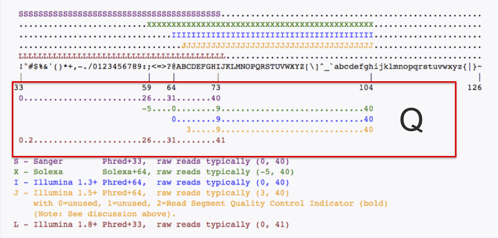
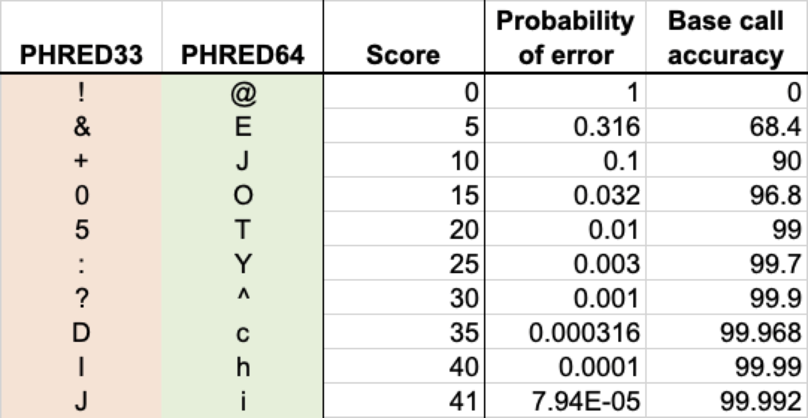

# Understanding FASTQ File formats

## Brief Description
FASTQ files are the standard means of storing and working with modern sequence data.  The Q in the file stands for "Quality", which is an assessment of the likelihood of error for each base in each sequence.  (FASTQ was used as an extension/adaptation of the standard "fasta" file format, which is the standard if there are no quality scores to be included.)
Each entry in a FASTQ file consists of four lines, with the following format:

<code><pre>
  @unique_sequence_ID   
  ATTCATTAAAGCAGTTTATTGGCTTAATGTACATCAGTGAAATCATAAATGCTAAAAATTTATGATAAAA 
  +   
  =-(DD--DDD/DD5:\*1B3&)-B6+8@+1(DDB:DD07/DB&3((+:?=8\*D+DDD+B)\*)B.8CDBDD4 
</pre></code>

## Features
1. The header line, starts with ‘@’,followed directly by an ID and an optional description
2. The sequence line, consisting of A, C, G, T (and sometimes N or other *ambiguous* characters).
3. A line consisting of only a "+" symbol
4. The quality line, which will match the sequence length exactly, and for which there is a one-to-one correspondence by character position. In other words, the quality of the first A is "=", the quality of the T in position 2 is -, and so on.

### Note
FASTQ files are typically very large (gigabytes or larger, with tens to hundreds of million sequence entries), and as such are frequently compressed.  The most common compression is with the program "gzip", and a file that has been compressed in this manner will typically be named in the manner "my_sequences.fastq.gz" with the gz final extension standing for "gzipped."  *Fortunately*, many of the programs we use to work with FASTQ files can use the gzipped version.

## What Do the Quality Scores Mean?
The quality score is a character-based representation of the base10 logarithm of the probability that the sequence base is incorrect (as determined by the sequencing machine process).  Specifically, if *p* is the probability of error, then the quality *Q* is given by

##  *Q* = -10 * log10(*p*)

For example, if the probability of error is estimated at 1 in 1000, *p* = 0.001, or *Q* = 30.  *Q* scores range between 0 (p = 1, a completely unreliable base call) and 40 (p = 0.0001).  To reduce these numbers to a one-base code, the numbers 0 through 40 have been mapped onto the ASCII table representation.  Several different representations have been generated for this, as shown below:

Most modern sequence uses the Sanger/Illumina 1.8+ coding.  Here are a few examples:

Questions?  E-mail me (jhgraber(at)mdibl.org) or put a question in the LabCentral documentation.
