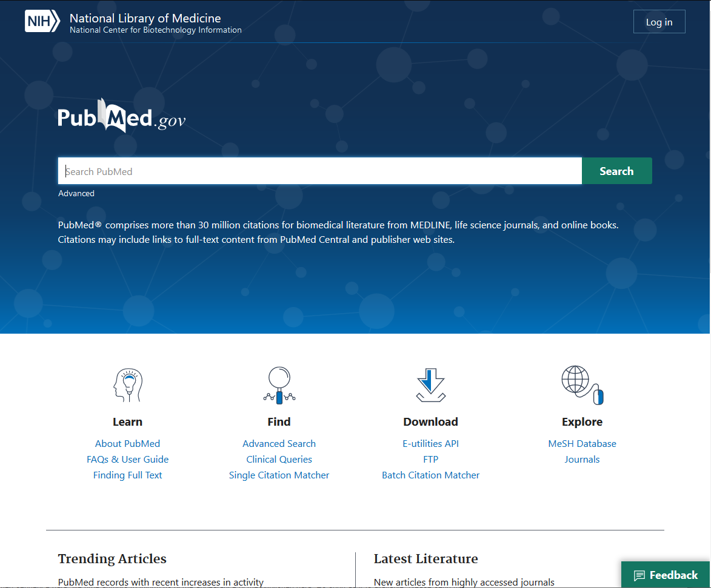
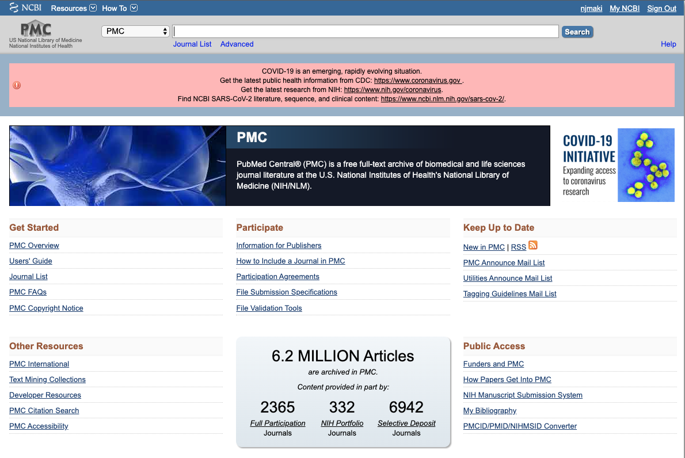
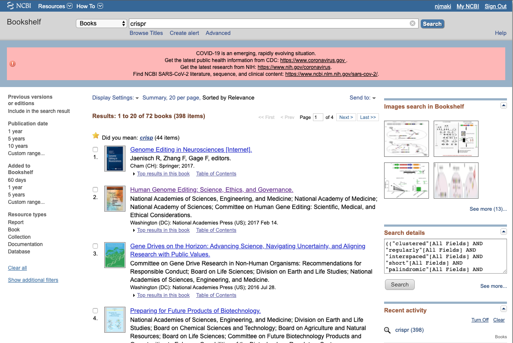
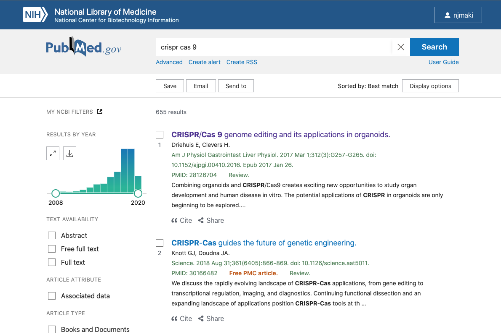
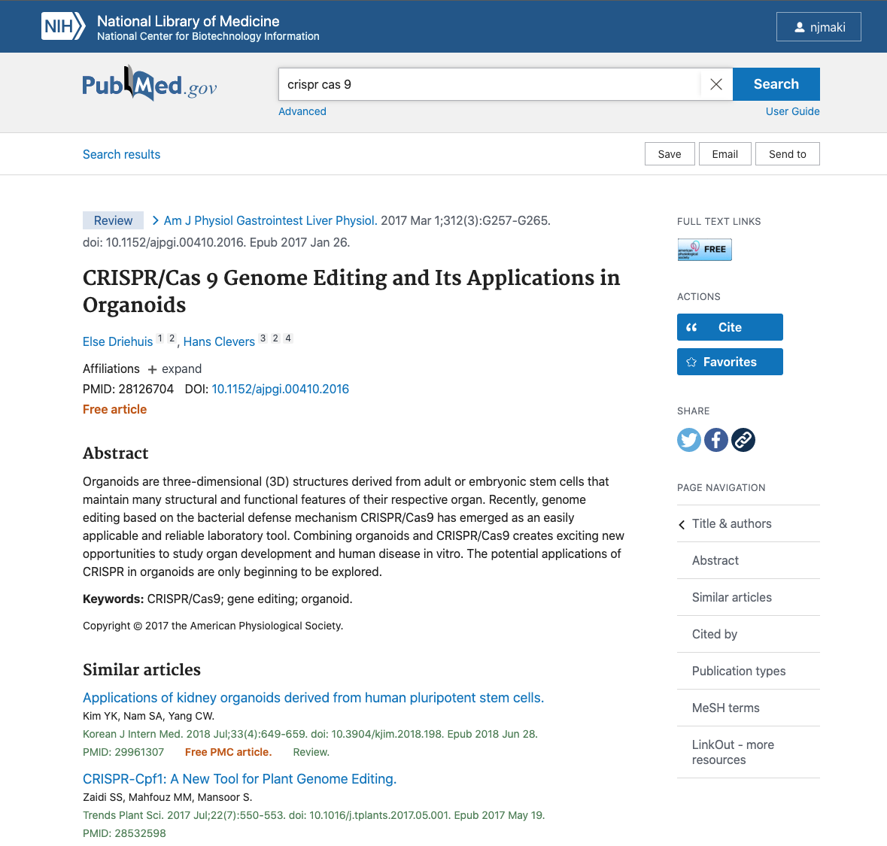
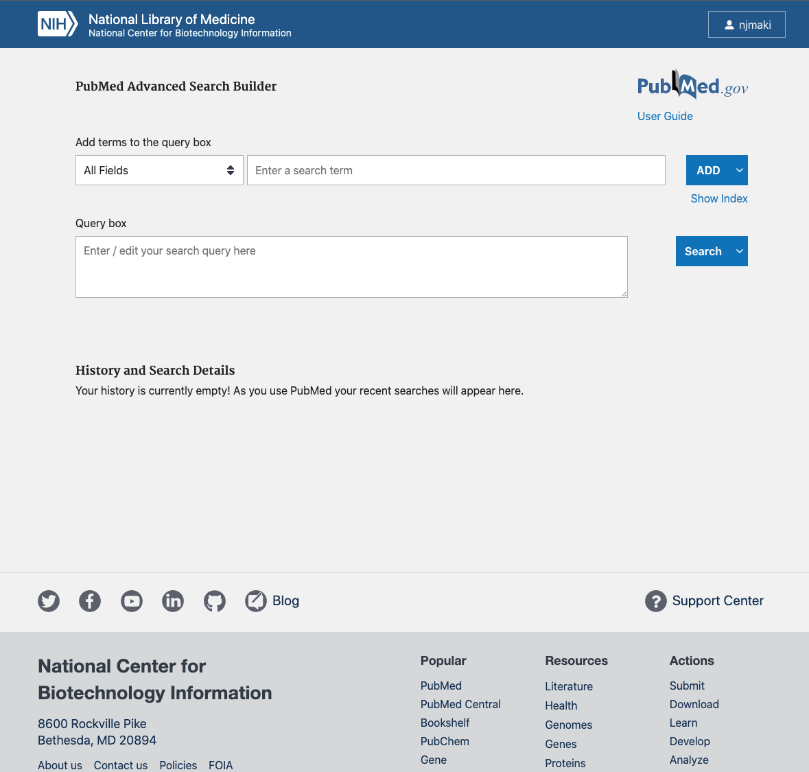
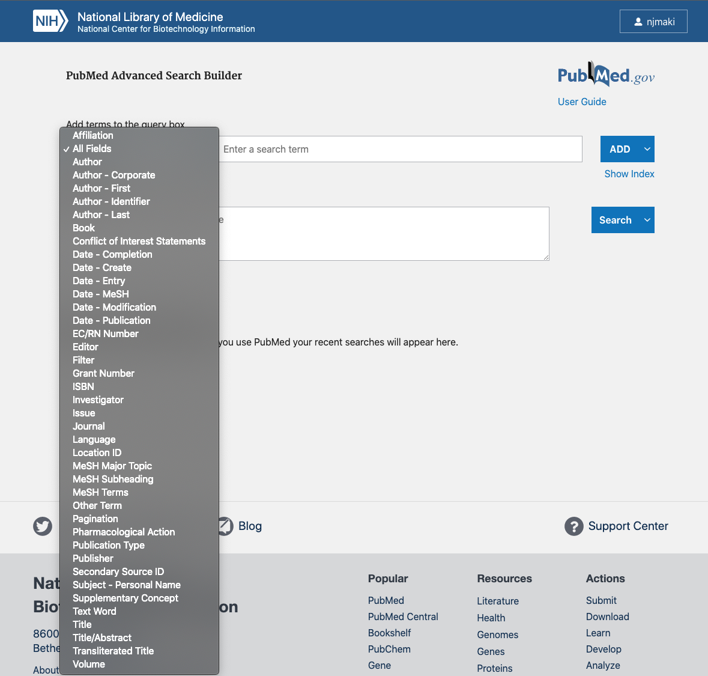
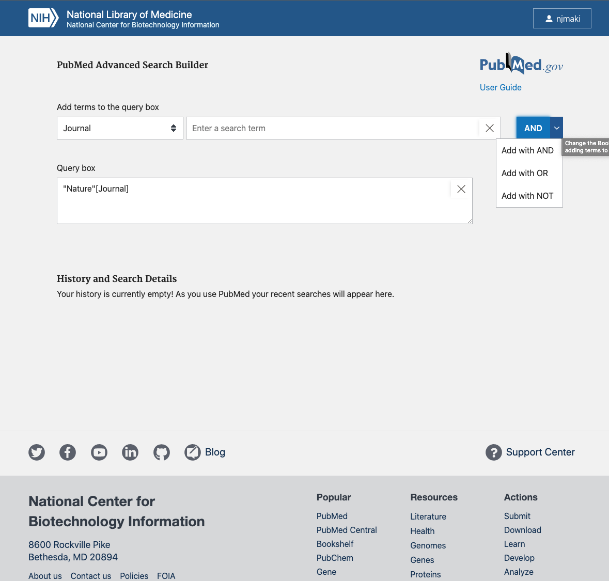
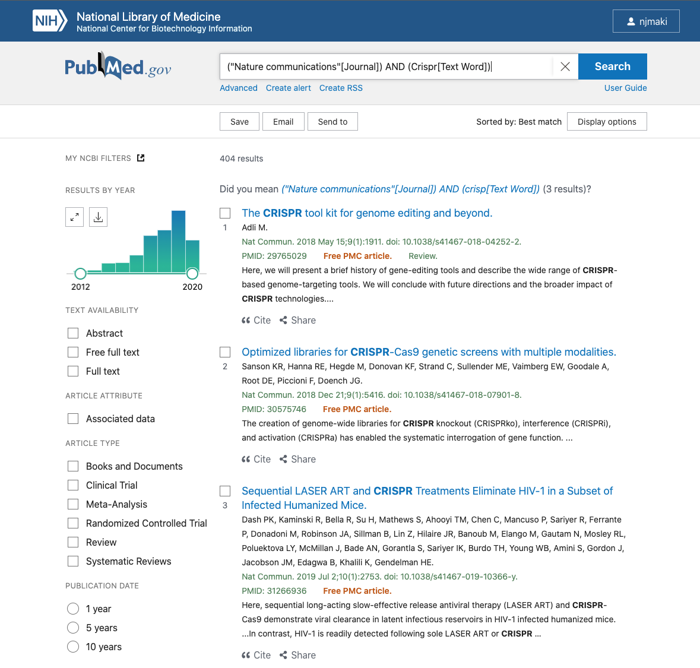
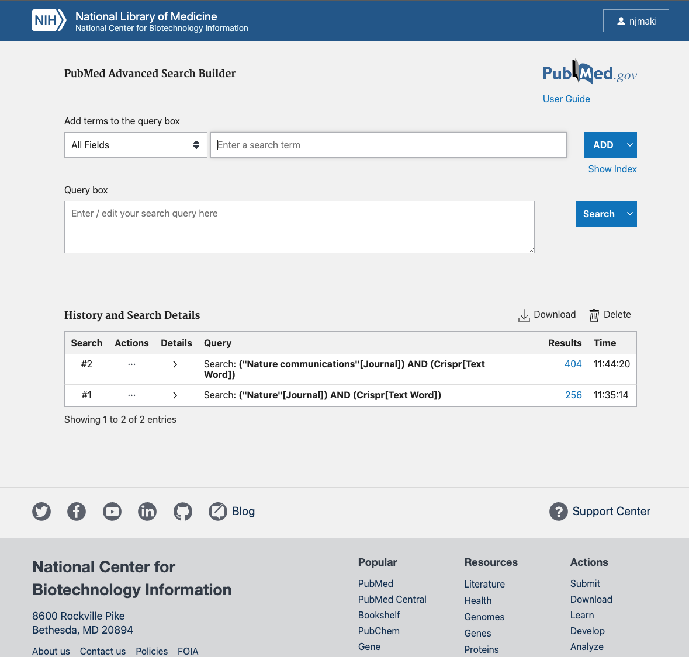

# Introduction to PubMed

## Learning Objectives

* Become familiar with accessing and navigating PubMed/PMC
* Use the General search and Advanced search builder to locate relevant literature

## Summary

* PubMed is a freely available literature resource, with content focused primarily on biomedical and life sciences research
* Comprised of over 30 million abstracts and citations
* Full text articles are not always available, though links are provided to publisher sites and/or PubMed Central (PMC)

## Logging in / Creating an NCBI Account

**Having an NCBI account greatly increases the flexibility of the tools and resources at your disposal.**

This includes working with NCBI's programming API:
* With a verified account, your API calls are not throttled, and you're afforded more compute than if you were to remain anonymous

Assists in searching for and submitting through NCBI:
* Saving of search strategies and queries built through PubMed and other repositories
* You're required to have an account for data submission

To sign in/create an account, click this [link](https://www.ncbi.nlm.nih.gov/account/?back_url=https%3A%2F%2Fwww.ncbi.nlm.nih.gov%2F)

## Platform Overview



PubMed draws from three main sources for citations and literature
* MEDLINE
* PMC
* BookShelf

### MEDLINE

US National Library of Medicine (NLM) primary bibliographic database, containing over 25 million references to journal articles with a focus on biomedicine
* Most of PubMed references are acquired from this source

A fair number of citations in MEDLINE are being updated with links to the free full text articles, archived in PMC

**If full text is not available through PMC, you can use the `Loansome Doc` feature to "borrow" the article through the National Network of Libraries of Medicine**

### PubMed Central (PMC)

Free archive of biomedical and life sciences journal literature, managed by NCBI, and contains over 5 million full text records, with records dating back to as late as the 1700s
* If a full text article exists in a PubMed record, often it will include a link to a sibling PMC page

Through the NIH Preprint Pilot (as of June 2020), also includes preprints that are the result of research funded by National Institutes of Health
  * Currently focused on preprints relating to SARS-CoV-2 virus and COVID-19



### Bookshelf

* Online archive that provides free access to books and documentation in the healthcare and life science fields
* Differentiates itself from PMC and MEDLINE by the depth of the content available



## Searching PubMed

**NCBI integrates its Entrez search system across all repositories. This means that while sometimes graphically divergent; building queries, locating search history, and finding related material will be functionally identical and uniform across platforms**

PubMed offers both `general` and `advanced` query functionality

### General Search

* To General search, type content into the `Search` box on the front page and hit enter
  * Depending on what you looked for, PubMed (using a machine learning algorithm) will do its best to find the most relevant citation(s)
  * While easy to use, a general search will often give you an overwhelming number of results



* You can use the filters on the left to help refine your records
* Once you've selected an entry:



* Notice the `Full Text Links` button, that will take you to the publisher page, where the full article is freely available to access
* You can use the `Page Navigation` links on the right to find similar articles and additional resources

### Advanced Search

* Advanced search is a bit more involved, but still fairly easy to use
* To access the `Advanced Search` builder, select `Advanced` under the general search bar



* To build a search query, first you need to `Add terms to the query box`
  * The dropdown menu gives you a large number of fields to choose from, which can be further refined by the terms entered
  * There is also an autocomplete feature built in that helps avoid spelling mistakes, and expands functionality



* You can also modify how these terms are interpreted by using boolean operators



* Once you've entered in all terms, click `Search`



* From here, you can refine your search in the same way that we covered in the `General search` component
* If you go back to the `PubMed Advanced Search Builder` page, you'll notice that near the bottom of the page, your History and Search Details are saved



* When signed in to NCBI, these queries are recorded, and provide a good reference point, should you ever need to revisit for similar content in the future

## Contact

If you have questions about the information in this workshop document, please contact:

```
Nathaniel Maki
Bioinformatics Research Training Specialist
MDI Biological Laboratory
nmaki[at]mdibl.org
```