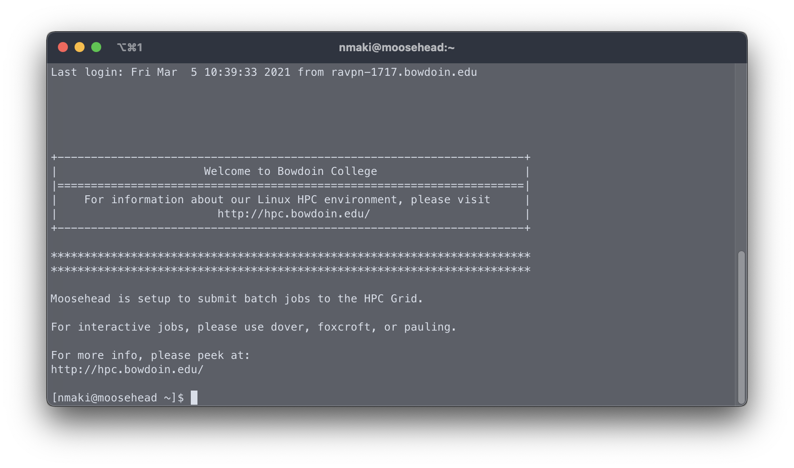

# Transcriptome Assembly Worksheet

## Learning Objectives
* Improve skills in filesystem navigation and file modification through the use of the CLI and nano
* Through the Bowdoin SGE Compute Cluster, use a Trinity script in conjunction with Commander to generate a basic transcriptome
* Understand the options contained within the Trinity script, and how they can impact your resulting Assembly

### Step 0: Connecting to the Cluster

This step has been covered in a previous lecture, and is required to proceed with this worksheet

In short, ensure that you've connected to the Bowdoin VPN, have logged into Moosehead, and that your terminal is displaying the following



### Step 1: Navigating through the Cluster ( where are all the things :thinking: )

The path to your specific User directory is `/mnt/courses/biol2566/people/` followed by your username

Once you've migrated into your directory, you should see folder such as `analysis`, `data`, etc

These are the folders that you'll be working with for the worksheet, and duration of the course

We are also going to be editing some template files, to point towards your specific directory structure

Those template files can be found at `/mnt/courses/biol2566/software/compbio_commander/paramfile_templates`

### Step 2: Copying Template files to qsub directory

First, create a directory called `qsub` in your home directory (reached by typing `cd ~`)

`cd` into `qsub`

Copy the template json files we've provided from the above path to the `qsub` directory

* `cp /mnt/courses/biol2566/software/compbio_commander/paramfile_templates/*.json ./`

### Step 3: Editing the Trinity json file

First, we're going to want to give the template file a more unique name

Using the `mv` command, change the name of the `bowdoin_trinity_template.json` file to `"username"_trinity_template.json`

* `mv bowdoin_trinity_template.json` `nmaki_trinity_template.json`

Now open the named `trinity_template.json` in `nano`

The default file will look like this:

```
{
	"job_details": {
		"job_name": "ENTER_YOUR_JOBNAME_HERE"
	},
	"experiment_details": {
		"pi": "PI_NAME",
		"experiment_name": "EXPERIMENT_NAME",
		"analysis_id": "ANALYSIS_ID",
		"sample_path": "/mnt/courses/biol2566/data",
		"analysis_path": "/mnt/courses/biol2566/people/YOUR_USERNAME/analysis",
		"workdir": "/mnt/hpc/tmp/YOUR_USERNAME",
		"sample_file": null,
		"sample_file_type": null
	},
	"sge_preamble":{
		"current_directory": true,
		"join_output": true,
		"email_address": "YOUR_EMAIL",
		"shell": "/bin/bash",
		"parallel_environment": "smp 16",
		"memory": "virtual_free=4g"
	},
	"misc_preamble": [
		"### ENVIRONMENT VARIABLES TO BE USED AT QSUB-SCRIPT LEVEL ONLY ###",
		"### DO NOT TRY TO REFERENCE THESE VARIABLES IN THE TRINITY COMMAND ###",
		"# Top level course space",
		"classdirectory='/mnt/courses/biol2566'",
		"",
		"# Temporary HPC directory for temporary runtime files",
		"hpctmp='/mnt/hpc/tmp/'$USER",
		""
	],
	"commands": [
		{
			"command": "Trinity",
			"batch": false,
			"tasks": 1,
			"cpus": 3,
			"memory": 128,
			"singularity_path": "$classdirectory/software/sif",
			"singularity_image": "trinity_v_latest.sif",
			"work_dir": null,
			"volumes": [
				{
					"host_path":"$classdirectory",
					"container_path":"/compbio"
				},
				{
					"host_path":"$hpctmp",
					"container_path":"/hpctmp"
				}
			],
			"options": [
				"--seqType fq",
				"--SS_lib_type RF",
				"--normalize_by_read_set",
				"--samples_file /compbio/data/PI_NAME/EXPERIMENT_NAME/SAMPLE_FILE_NAME",
				"--trimmomatic",
				"--max_memory 64G",
				"--CPU 16",
				"--workdir /hpctmp/ENTER_YOUR_JOBNAME_HERE-$JOB_ID",
				"--output /hpctmp/ENTER_YOUR_JOBNAME_HERE-$JOB_ID"
			],
			"arguments":null
		}
	],
	"cleanup":[
		"",
		"# sync and wait for a bit",
		"sync",
		"sleep 60s",
		"",
		"# copy final output file from temporary working directory",
		"cp $hpctmp/ENTER_YOUR_JOBNAME_HERE-$JOB_ID/Trinity.* $classdirectory/people/$USER/analysis/PI_NAME/EXPERIMENT_NAME/ANALYSIS_ID/Trinity"
	]
}
```

You'll need to replace anything in ALL-CAPS with details relative to your username and options that we'll define below

* Ignore the `misc_preamble`, that does not need to be modified

Lets edit the file together, moving through it block by block

The block identifier will be denoted in **bold**, with expected output following below that
#### 3.1: job_details

* Update the "job_name" entry with a new id (can be something as simple as nmaki_trinity_test)

**Expected**

```
"job_details": {
		"job_name": "nmaki_trinity_test"
```

#### 3.2: experiment_details

* Update the "pi" entry to "Bowdoin"
* Update the "experiment_name" entry to "jcoffman_001.reduced"
* Update the "analysis_id" entry to an id of your choosing (can be 123456789)
* Update the "analysis_path" entry with your username where specified
* Update the "workdir" entry with your username where specified

**Expected**

```
"experiment_details": {
		"pi": "Bowdoin",
		"experiment_name": "jcoffman_001.reduced",
		"analysis_id": "0123456789",
		"sample_path": "/mnt/courses/biol2566/data",
		"analysis_path": "/mnt/courses/biol2566/people/nmaki/analysis",
		"workdir": "/mnt/hpc/tmp/nmaki",
		"sample_file": null,
		"sample_file_type": null
```

#### 3.3: sge_preamble

* Update the "email_address" entry to point to your email

**Expected**

```
"sge_preamble":{
		"current_directory": true,
		"join_output": true,
		"email_address": "nmaki@mdibl.org",
		"shell": "/bin/bash",
		"parallel_environment": "smp 16",
		"memory": "virtual_free=4g"
```

#### 3.4: misc_preamble

* Ignore me

#### 3.5: commands

* Ignore the entries up until the "options" block
* Update the "--samples_file" option with the details for "pi_name" and "experiment_name" respectively
  * We didn't define the "SAMPLE_FILE_NAME" previously, it is `jcoffman_001.reduced.samples.txt`
* Update the "--workdir" option with the "JOBNAME" we defined at the top of the file
* Update the "--output" option with the "JOBNAME" we defined at the top of the file

**Expected**

```
"commands": [
		{
			"command": "Trinity",
			"batch": false,
			"tasks": 1,
			"cpus": 3,
			"memory": 128,
			"singularity_path": "$classdirectory/software/sif",
			"singularity_image": "trinity_v_latest.sif",
			"work_dir": null,
			"volumes": [
				{
					"host_path":"$classdirectory",
					"container_path":"/compbio"
				},
				{
					"host_path":"$hpctmp",
					"container_path":"/hpctmp"
				}
			],
			"options": [
				"--seqType fq",
				"--SS_lib_type RF",
				"--normalize_by_read_set",
				"--samples_file /compbio/data/Bowdoin/jcoffman_001.reduced/jcoffman_001.reduced.samples.txt",
				"--trimmomatic",
				"--max_memory 64G",
				"--CPU 16",
				"--workdir /hpctmp/nmaki_trinity_test-$JOB_ID",
				"--output /hpctmp/nmaki_trinity_test-$JOB_ID"
			],
			"arguments":null
		}
	],
```

#### 3.6 cleanup

* Update the final line of the script, starting with `"cp`, with your JOBNAME, PI_NAME, EXPERIMENT_NAME, and ANALYSIS_ID using the inputs we defined in the "experiment_details" block above

**Expected**

```
"cleanup":[
		"",
		"# sync and wait for a bit",
		"sync",
		"sleep 60s",
		"",
		"# copy final output file from temporary working directory",
		"cp $hpctmp/nmaki_trinity_test-$JOB_ID/Trinity.* $classdirectory/people/$USER/analysis/Bowdoin/jcoffman_001.reduced/0123456789/Trinity"
	]
```

### Step 4: Executing Commander on edited Trinity json file

Once you've made all the necessary changes, and your script closely resembles the example above, save your changes with `ctrl + o` and then exit out of `nano` using `ctrl + x`

`/mnt/courses/biol2566/software/compbio_commander/commander --sge --preflight nmaki_trinity_template.json`

### Step 5: Launching the Trinity shell script through qsub