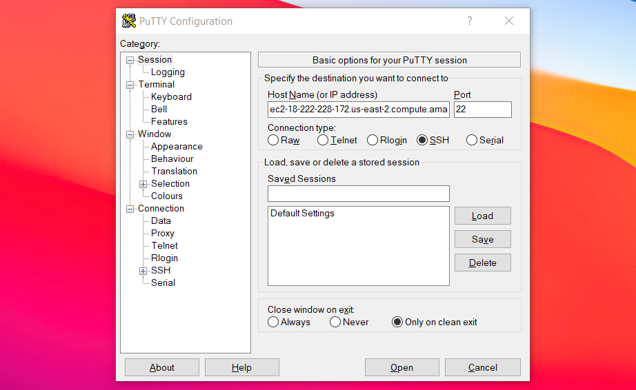
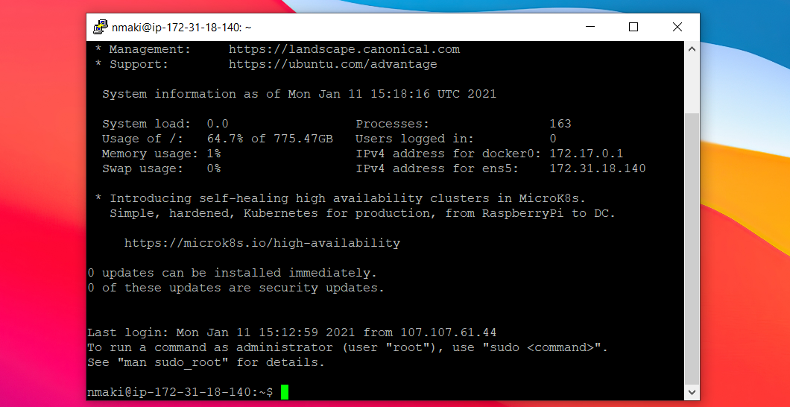
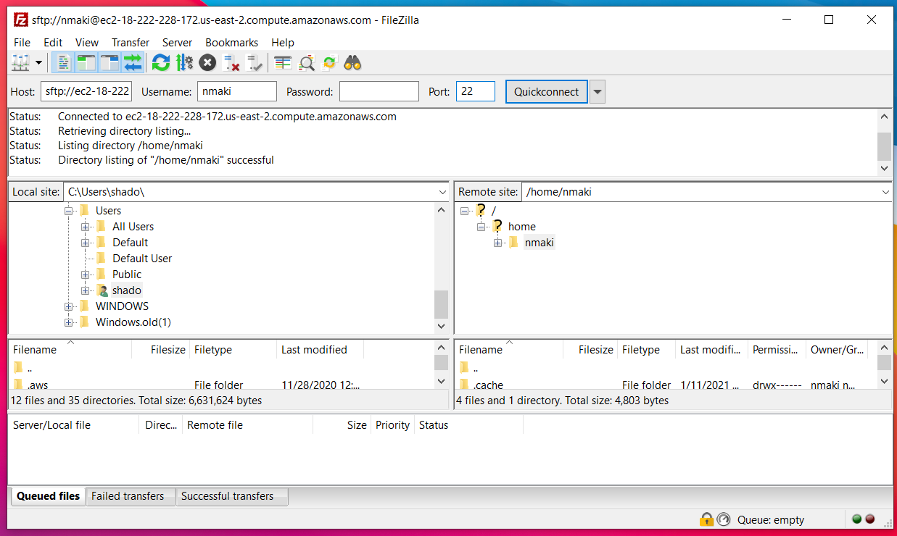

# Overview of Alternative Software

## Learning Objectives
* Provide a brief introduction to a few supplementary/alternative pieces of software, tailored towards Windows users
* Installation and/or exploration of PuTTY and FileZilla

## Summary
* PuTTY offers a Windows-Version agnostic method of connecting to a remote machine via SSH
* FileZilla provides a way of transferring files between local and remote machines, when command line tools such as `rsync` may not be available (or desired)
  
### PuTTY + FileZilla

PuTTY is a free implementation of SSH for Windows, and will let you easily access your remote Amazon instance
* To install PuTTY, follow this [Link](https://www.chiark.greenend.org.uk/~sgtatham/putty/latest.html) and select the 64-bit MSI installer
* To connect, launch PuTTY and paste your Amazon instance name under `Host Name` and click `Open`

* Click `Yes` on the initial prompt asking about ECSA key, and then enter your username and password to login

FileZilla, on the other hand, is a (free) FTP tool, letting you move data between remote machines and local
* To install FileZilla, follow this [Link](https://filezilla-project.org/download.php?type=client), click `Download FileZilla Client`, and choose the standard FileZilla "version"
  * When running through the installer, be sure to choose `no` on the additional installation of McAfee
* To connect, launch FileZilla and paste your Amazon instance name under `Host`, followed by entering your username and password under `Username` and `Password` respectively, and entering 22 for `Port`, and selecting the `Quickconnect` button

