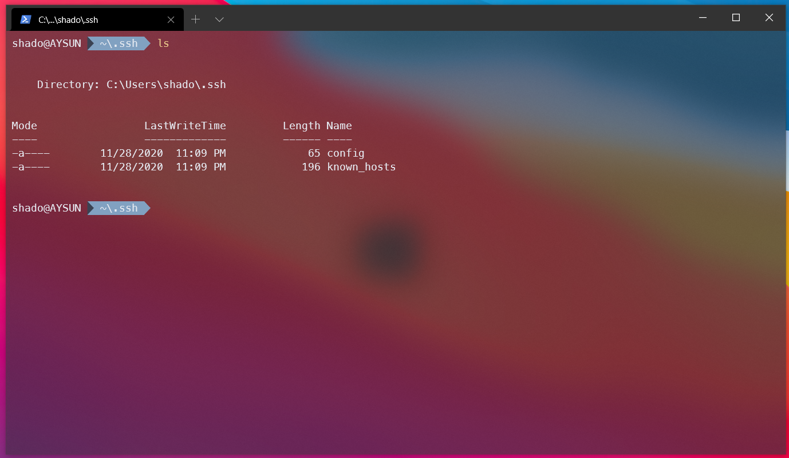
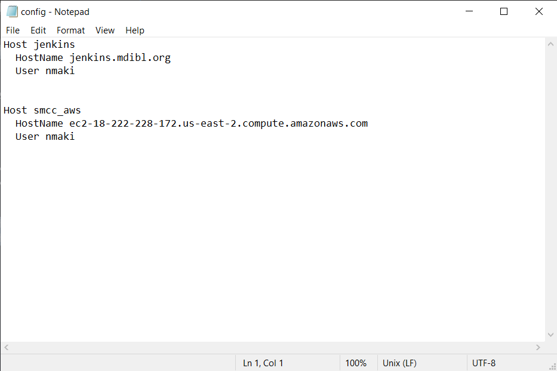
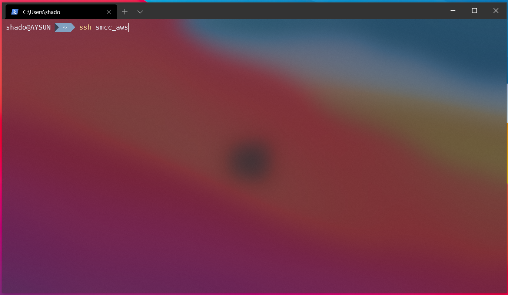

# Configuring SSH

## Learning Objectives
* Create an SSH config file in both Windows and Linux
* Edit the config file with an SSH host
* Use alias defined in config file for SSH

This is a short quality-of-life guide for anyone who doesn't have prior experience working with SSH configuration files

A config file gets rid of having to remember long and unwieldy remote machine names, and makes connecting to them via SSH that much easier

This is primarily targeted towards Windows users, but there is a portion for those on Linux/Unix systems as wll

## Windows

Open PowerShell and type in the following command:
* `cd ~/.ssh`
* This brings you to your "hidden" ssh directory 

Use `ls` to check the contents of the folder

If there is no config file present, create one using:
* `ni config`

Then, open it with:
* `notepad config`

Here is where you'll give your host machine a more concise name like soL

You can see in my example that I named the `Host` smcc_aws
* `Hostname` is where you'd paste the full length name of your Amazon machine
* `User` is whichever account you use to log into that machine

Save your changes and go back to your PowerShell window

Now when you go to remote in, instead of typing in `ssh` `user@ec2.....`, simply provide `ssh` followed by whatever you gave as a name for the `Host` in your config file

It should look something like this

