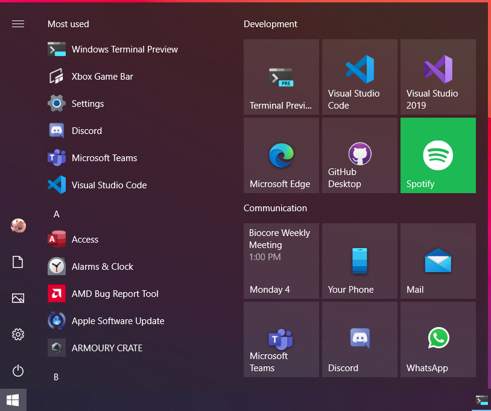
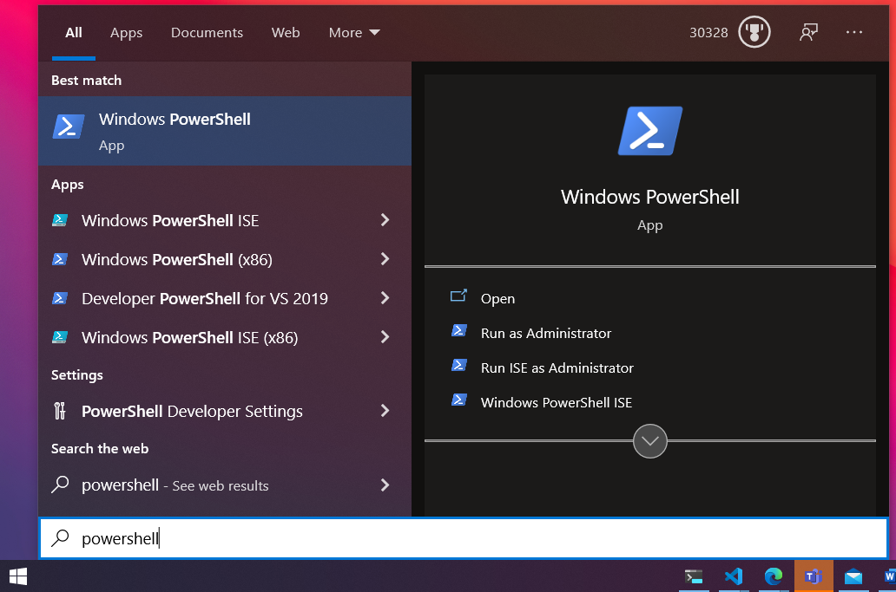
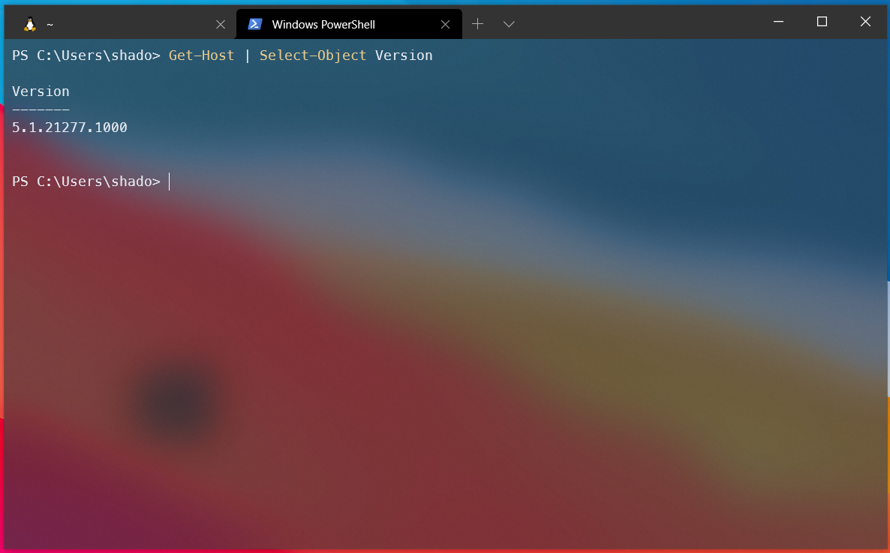
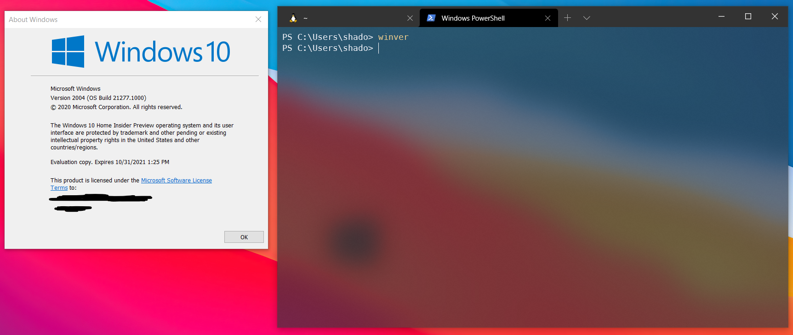
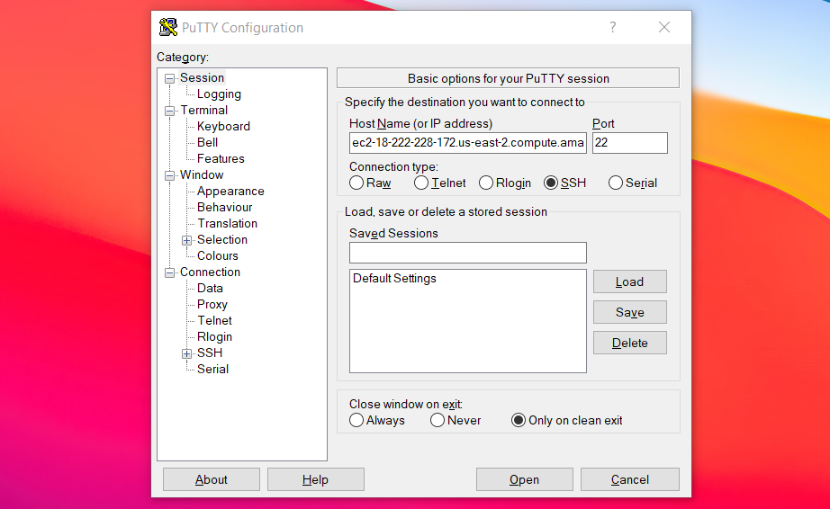
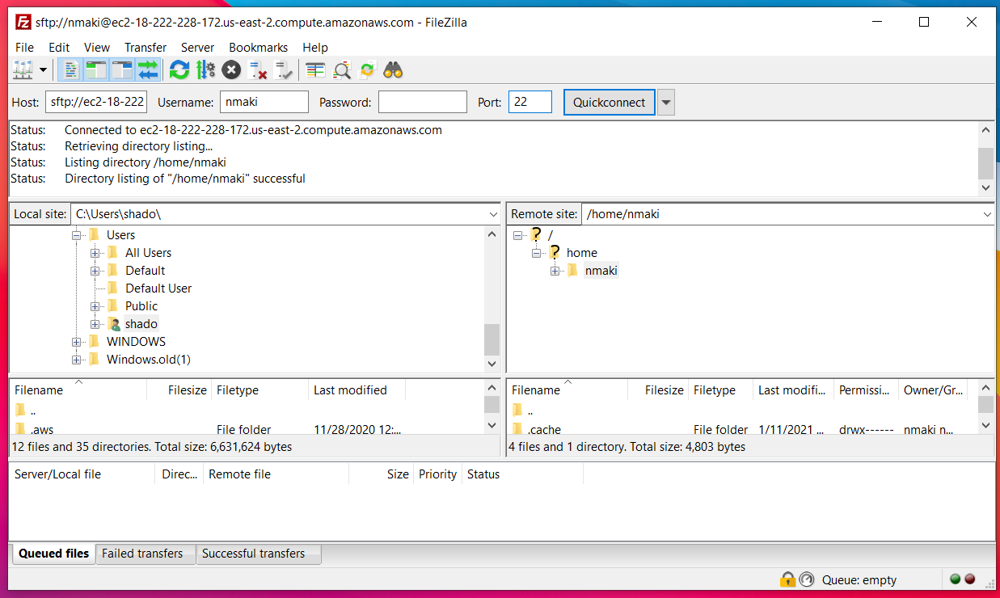
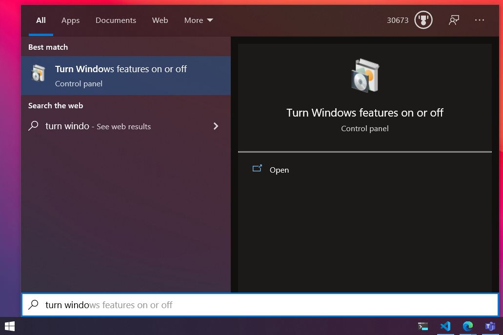
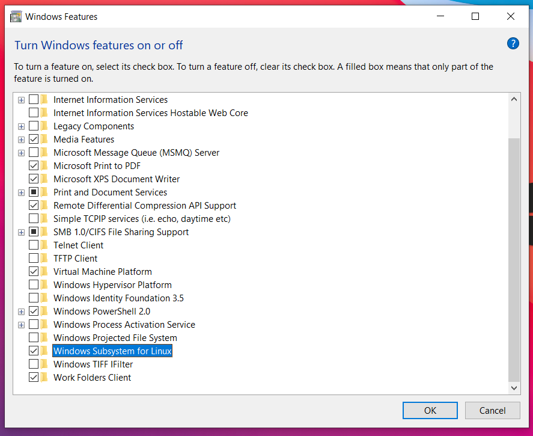
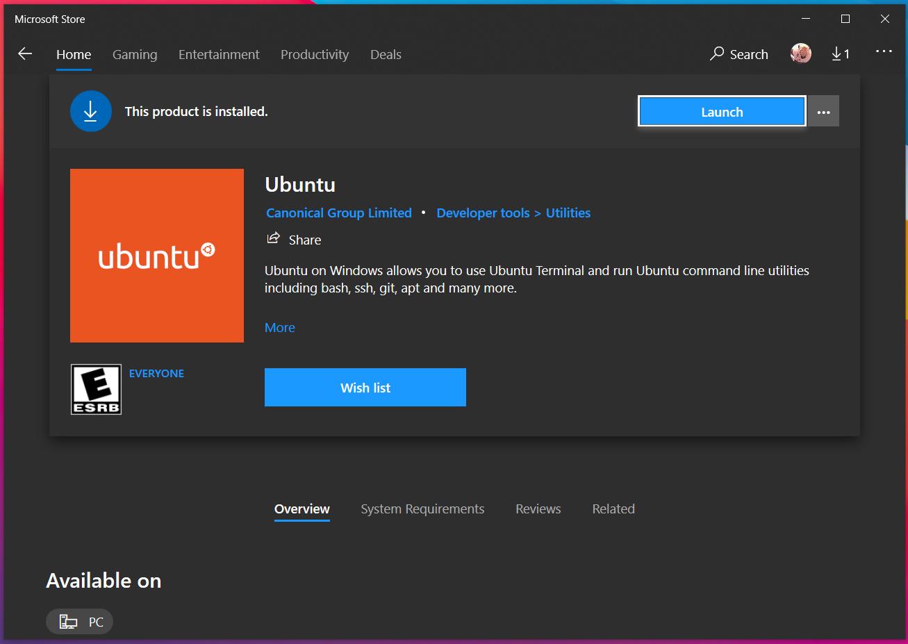
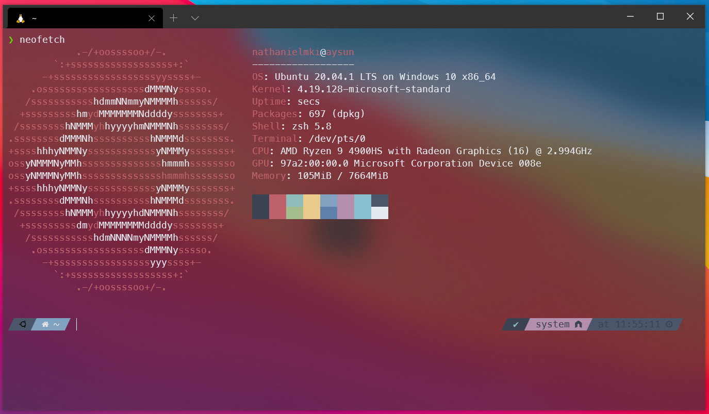

# Introduction to the Windows Subsystem for Linux

## Learning Objectives
* Introduction to PowerShell
* Installation of alternative toolset (PuTTY + FileZilla)
* Learn how to enable the WSL feature-set 
* Install the Ubuntu Linux distribution from the Microsoft Store
* Launch Ubuntu Linux and install a small piece of software

## Summary
* PowerShell, an integrated Command Line Interface (CLI) within Windows, has the capability to connect to remote machines via SSH
* PuTTY offers Windows-Version agnostic method of connecting to a remote machine via SSH
* FileZilla provides a way of transfering files between local and remote machines, when command line tools such as `rsync` may not be available (or desired)
* For Windows users, PowerShell acts as a robust test environment for basic command line proficiency to be established
* If looking for a more comprehensive "Unix-on-Windows" experience, install and work within the Windows Subsystem for Linux (WSL) 

## A Couple Caveats

Before we begin, there are a couple things that I'd like to point out, mostly to save you time

**If all you're looking to do is to remote into a server via SSH, then enabling WSL and installing Ubuntu Linux is probably overkill**  
* If your Windows 10 release version is **1809** or higher, and you are running **PowerShell 5.1** or higher, you already have SSH capabilities
* This means that you can remotely connect to a server via PowerShell without any additional installations

**If on a Windows OS earlier than Windows 10 1809 (Windows 7, 8, 8.1 etc), you'll have to enable ssh by installing the OpenSSH feature into powershell**

**Alternatively, a combination of FileZilla and PuTTY will work as well**

### Launching PowerShell

**Open the start menu**



**Search for powershell and select from menu**



To check which version of PowerShell you have installed, run the following command:
  * `Get-Host | Select-Object Version`



To see which version of Windows you're on, enter `winver` into the PowerShell commandline



If you meet all of the criteria above, feel free to remote away :blush:

If not, you need to install the OpenSSh plugin, or you can work with PuTTY and Filezilla to get similar funtionality:

### Installing OpenSSH into PowerShell (For Windows Version 7 +)

First search for `Optional Features` on the Windows start menu
* Select `+ Add a feature`
* Search the list for `OpenSSH Client`
* Select `Install`
* After install completes, reboot

### PuTTY + FileZilla

PuTTY is a free implementation of SSH for Windows, and will let you easily access your remote Amazon instance
* To install PuTTY, follow this [Link](https://www.chiark.greenend.org.uk/~sgtatham/putty/latest.html) and select the 64-bit MSI installer
* To connect, launch PuTTY and paste your Amazon instance name under `Host Name` and click `Open`



* Click `Yes` on the initial prompt asking about ECSA key, and then enter your username and password to login


FileZilla, on the other hand, is a (free) FTP tool, letting you move data between remote machines and local
* To install FileZilla, follow this [Link](https://filezilla-project.org/download.php?type=client), click `Download FileZilla Client`, and choose the standard FileZilla "version"
  * When running through the installer, be sure to choose `no` on the additional installation of McAfee
* To connect, launch FileZilla and paste your Amazon instance name under `Host`, followed by entering your username and password under `Username` and `Password` respetively, and entering 22 for `Port`, and selecting the `Quickconnect` button



For those on PowerShell, if you'd like a nice quality of life upgrade, you can install the Windows Terminal from the Microsoft Store
* Windows Terminal is a fast, customizable, and modern terminal application, specifically built for Windows 10

It acts as a hub of sorts for Command Prompt, PowerShell, and WSL, and natively supports many terminal features that can be found on MacOS/Linux distributions

## Windows Subsystem for Linux

<p>In a nutshell, WSL lets you execute a Linux environment directly in Windows. No virtual machine or VM software required

At the moment, you are constrained to command-line tools and applications, though Microsoft is working to bring full GUI
applications to the platform. 

This lets you leverage the wide range of professional programs developed for Windows, along with 
the vast repositories of free and open source software built on and for Linux</p>

* WSL allows for the running of many common command-line tools, including: 
* `rsync`, `grep`,`awk`,`sed`
* Execution of Bash shell scripts
* Linux CLI apps like tmux, vim, and emacs
* Language support for Python, Ruby, NodeJS, etc
* Utilization of the selected Linux distributions package manager: installation of additional software/tools 

## Enabling WSL

**WSL is supported on Windows 10 version 1709 and higher**  

**If you are running an earlier build, you need to update your system to gain access to this feature** 

With the above requirement met, turning on WSL is fairly straightforward, especially as it comes baked into Windows.  

### If you are comfortable working on the command line 
* Open an elevated (administrator) PowerShell window
  * To do so, right click on the **Windows PowerShell** application and select *Run as administrator*
* Next, paste the following code into your open, elevated PowerShell window: 
  * `dism.exe /online /enable-feature /featurename:Microsoft-Windows-Subsystem-Linux /all /norestart`
* Reboot your computer at earliest convenience

### If you'd rather use the Graphical User Interface (GUI)

**Open the start menu and search for *turn Windows features on or off***



**Scroll down and check the box marked *Windows Subsystem for Linux***



**Click OK and Restart**

## Installing a Linux Distribution

**Enabling WSL is the first step, the second being to choose a Linux distribution to install from the Microsoft Store**

Microsoft offers a few distributions of Linux, including Debian, OpenSUSE, Ubuntu, and Kali. For this example, we're going to work with Ubuntu.

Developed by the company Canonical, Ubuntu is one of the most widely used and supported Linux distributions, in part due to it's stability and robust feature-set. It's LTS (Long Term Support) versions are supported for up to 5 years after launch!

There are a couple LTS Ubuntu distributions available, but we're going to want the one marked simply **Ubuntu**, with no numbers next to the name.

This is built off of the most recent release of the OS, 20.04, and came out in April of this year.

**Open up the Microsoft Store and search "Ubuntu"**



* From there, just click *install*, and once it finishes, *launch*  
* Follow along with the on screen prompts (creating a username/password, etc)
* **Great! You've successfully installed and configured Ubuntu Linux on your Windows machine :)**
* For a quick test-run, try installing the program Neofetch 
  * Neofetch is a small tool that gives you an overview of your system resources, along with a neat little distribution-specific ASCII graphic
  * First, add the repository (software source): `sudo add-apt-repository ppa:dawidd0811/neofetch`
  * then run `sudo apt-get install neofetch`
  * after the program is installed, run it by executing `neofetch` on the command line



#### Navigating to the Windows Filesystem
* By default, when launching your installed Linux distribution through WSL, you will be placed in your instance-specific home directory
* To work with files/folders that exist on your Windows Filesystem, you can use the following command: `cd /mnt/`, followed by the letter of the drive where your data is stored on
  * For example, if you've saved your output data to the `C:` drive, then your command would look like this: `cd /mnt/c`. If you've saved to another drive, just replace `c` with that letter (`d`,`e`,etc)

## Contact

If you have questions about the information in this workshop document, please contact:

```
Nathaniel Maki
Bioinformatics Research Training Specialist
MDI Biological Laboratory
nmaki[at]mdibl.org
```

