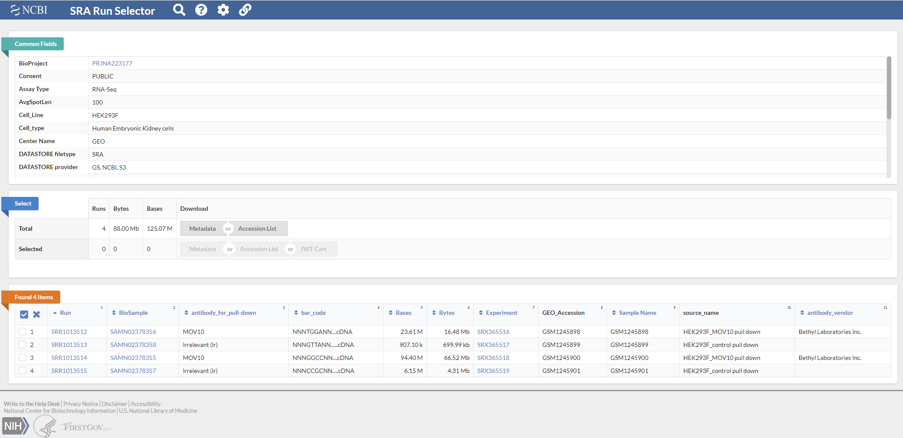

**add images to improve guide**
## What is SRA?
The Sequence Read Archive, or SRA, is an online archive for raw sequence data, generated from next generation sequencing tech such as Illumina, PacBio, and IonTorrent.

It is also the National Institute of Health's (NIH) primary repository for high throughput sequencing data.

## What is the SRA Toolkit?
The SRA Toolkit is a suite of compiled binaries and source code for tools that download, manipulate, and validate next generation HTS data stored inthe SRA archive.

## Learning Objectives
* Become comfortable working with the SRA, navigating through the site, and acquiring SRA data
* Explore the SRA Toolkits' various functions and utilities
* Using an SRA accession file, download corresponding experimental fastq data from archive

## Installing SRA Toolkit
Lets get this out of the way first:
* Potentially just point to the NCBI Github page:
  `https://github.com/ncbi/sra-tools/wiki/02.-Installing-SRA-Toolkit`
* [Click this link view the Download page](https://trace.ncbi.nlm.nih.gov/Traces/sra/sra.cgi?view=software)
* Compiled binaries exist for macOS and RHEL/Ubuntu based Linux distributions
* If running Windows (follow up with guide to install WSL Ubuntu 20.04)
  * The above is only needed if you want to use the newest binaries (as of date, 2.10.5)
  * Otherwise, just use Toolkit version 2.9.6-1
* Unzip the tar.gz file
  * if using macOS or Windows, either double click or right click and select extract
  * for Linux use `tar -xzf sratoolkit.version-ubuntu_linux64.tar.gz`
* If you are working from the command line, you can utilize the NCBI FTP site and download the Toolkit via `wget https://ftp.ncbi.nlm.nih.gov/sra/sdk/2.10.5/sratoolkit.2.10.5-ubuntu64.tar.gz`

## Alternative: Using Brew
It took me some time to install sratools through NCBI documentation, so here is another, easier, method.
Instead of going through the process manually, you can install it using Homebrew, an (imo fantastic) package manager for macOS and Linux
* To install Homebrew, just past the following into your terminal: `/bin/bash -c "$(curl -fsSL https://raw.githubusercontent.com/Homebrew/install/master/install.sh)"`
**Follow up on WSL/Linux Installation, running into issues with perl**
* Once homebrew is installed, you need to add the tap brewsci/bio
  * This contains tons of bioinformatics packages, with one included being sratoolkit
  * Simply type `brew tap brewsci/bio` in the command line
  * Once added, follow up with `brew install sratoolkit`
* Installing sratoolkit in this fashion adds it to your PATH (which normally you have to do manually), and you can immediatly progress with the next component of this tutorial
* In a nutshell, adding a program to PATH allows you to use it anywhere in the filesystem, not just in the location in which it's located.
  * Instead of having to give a direct path to fastq-dump like this: `~/sra-toolkit/bin/fastq-dump.2.10.5 -X`
  * You can immedially use it like so: `fastq-dump -X` on the command line

## Alternative Alternative: Use Docker
* For macOS and Windows, install Docker Desktop
* Run the following `docker pull inutano/sra-toolkit`
* Linux is a bit more involved, but the documentation does a pretty goopd job of providing a walkthrough
  * **post doc here**

## Downloading data from SRA
**Include image for below**
The Sequence Read Archive can be broken into four main levels, each with their own specific accession IDs
* Study: DRP, ERP, SRP accessions
* Sample: DRS, ERS, SRS accessions
* Analysis: DRZ, ERZ, SRZ accessions
* Run: DRR, ERR, SRR accessions

**will introduce GEO before SRA**

The smallest unit able to published in the SRA is an Analysis, but most of the neat stuff can be found in Studies.

We'll be using this one [GEO summary page](https://www.ncbi.nlm.nih.gov/geo/query/acc.cgi?acc=GSE51443) as an example.

To find the SRA link, just scroll down from the top of the page:

And look near the bottom, and under **Relations** select the SRA accession link

The accession link brings you to a page that holds all biological samples related to this analysis.
Selecting, for example, this [Link](https://www.ncbi.nlm.nih.gov/sra/SRX365519[accn]) loads that specific run, and the files associated with it.

However, we want to view all files with every sample in an analysis.
To do this:
* Click **Send to**, located below the runs and across from the summary button
* Choose **Run Selector** as your Destination
* Click **Go** to send the entire recordset to Run Selector

The SRA Run Selector page should open upo in another tab, and lookc like this:

Under **Common Fields** you'll find a ton of information describing the samples from the study, including:
* Assay Type (RNA-seq, CHiP-seq, etc)
* Instrument (Sequencing platform utilized)
* Library Layout (Single or Paired End sequencing)
* Organism
* as well as a plethora of other relevant information

Under **Select** you have the option to download either all Metadata or an Accession List, or just those that are selected from the **Found X Items**
* The **Metadata** option downloads metadata for all runs as a table, or as a list of accession numbers
* The **Accession** option downloads a text file with all of the SRA accession IDs from the study
* For additional information about many of the fields on this page, click the *Question mark* icon at the top of the page

## Downloading Experimental Data from SRA using fastq-dump