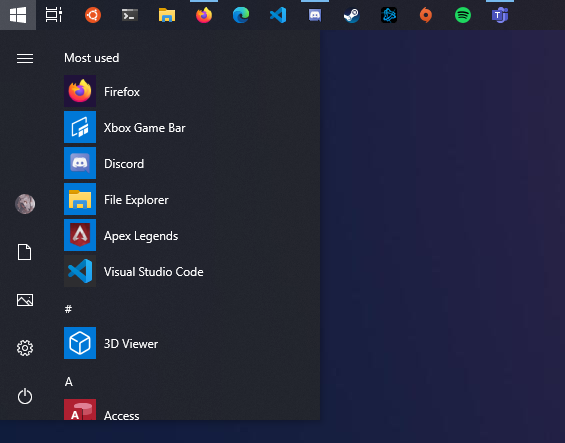
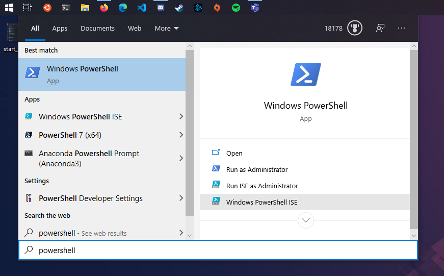
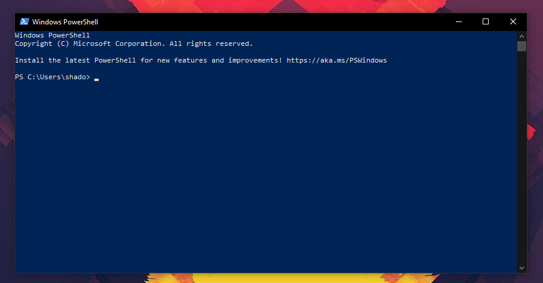
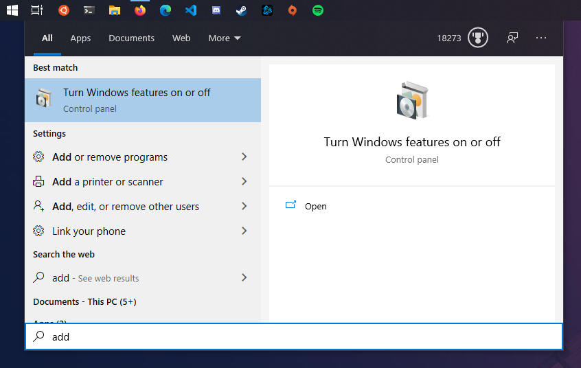
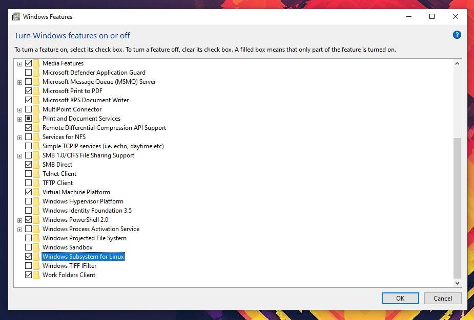
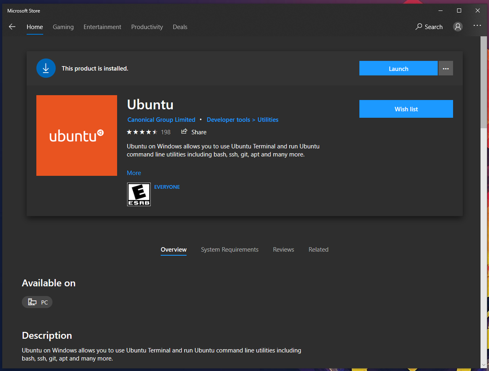
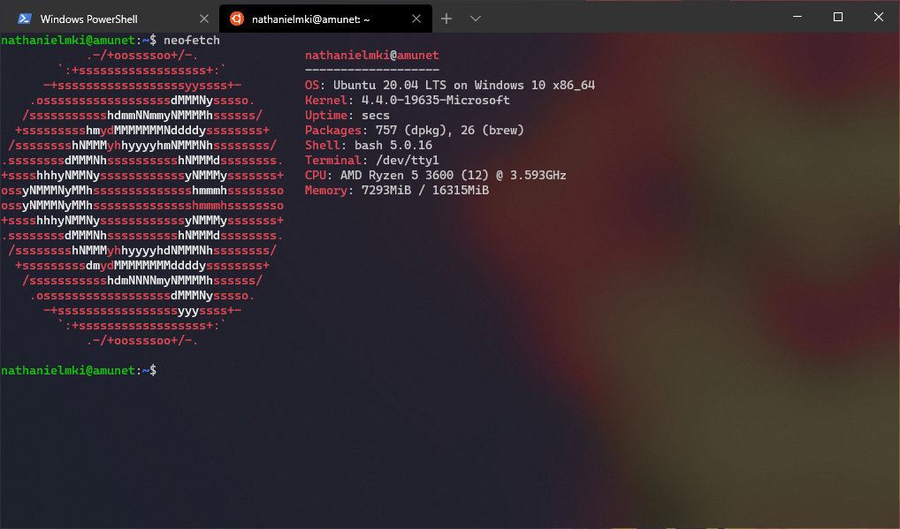

# Introduction to the Windows Subsystem for Linux

## Learning Objectives
* Become introduced to PowerShell
* Learn how to enable the WSL feature-set 
* Install the Ubuntu Linux distribution from the Microsoft Store
* Launch Ubuntu Linux and install a small piece of software

## Summary
* PowerShell, an integrated Command Line Interface (CLI) within Windows, has the capability to connect to remote machines via SSH
* For Windows users, PowerShell acts as a robust test environment for basic command line proficiency to be established
* If searching for a more comprehensive "Unix-on-Windows" experience, install and work within the Windows Subsystem for Linux (WSL) 

## A Couple Caveats

Before we begin, there are a couple things that I'd like to point out, mostly to save you time.

**If all you're looking to do is remote into a server via SSH, then enabling WSL and installing Ubuntu Linux is unneccesary.**  
* If your Windows 10 release version is **1809** or higher, and are running **PowerShell 5.1** installed, OpenSSH is built in

### Launching PowerShell

#### Open the start menu  

#### Search for powershell  

#### Select from the menu  

* To check which version of PowerShell you have installed, run the following command:
    * `Get-Host | Select-Object Version`
* If you meet all of the criteria above, open a PowerShell window and SSH away!

* Additionally, if you'd like a nice quality of life addition, you can install Windows Terminal from the Microsoft Store
  * Windows Terminal is a fast, customizable, and modern terminal application, specifically built for Windows 10
  * It acts as a hub of sorts for Command Prompt, PowerShell, and WSL
  * Natively supports many terminal features that can be found on MacOS/Linux distros

With that out of the way, let's begin!

## Windows Subsystem for Linux

In a nutshell, WSL lets you execute a Linux environment directly in Windows. No virtual machine or VM software required.

At the moment, you are constrained to command-line tools and applications, though Microsoft is working to bring full GUI
applications to the platform. 

This lets you leverage the wide range of professional programs developed for Windows, along with 
the vast repositories of free and open source software built on and for Linux.

* WSL allows for the running of many common command-line tools, including: 
* `grep`,`awk`,`sed`
* Execution of Bash shell scripts
* Linux CLI apps like tmux, vim, and emacs
* Language support for Python, Ruby, NodeJS, etc
* Utilization of the selected Linux distributions package manager: installation of additional software/tools 

## Enabling WSL

**WSL is supported on Windows 10 version 1709 and higher**  

**If you are running an earlier build, you need to update your system to gain access to this feature** 

With the above requirement met, turning on WSL is pretty straightforward, especially as it comes baked into Windows.  

### If you are comfortable working on the command line 
* Open an elevated (administrator) PowerShell window
  * To do so, right click on the **Windows PowerShell** application and select *Run as administrator*
* Next, paste the following code into your open, elevated PowerShell window: 
  * `dism.exe /online /enable-feature /featurename:Microsoft-Windows-Subsystem-Linux /all /norestart`
* Reboot your computer

### If you'd rather use the GUI

#### Open the start menu and search for *turn windows features on or off*  

#### Scroll down and click the box marked *Windows Subsystem for Linux*  

#### Click OK and Reboot!

## Installing a Linux Distribution

#### Enabling WSL is the first step, the second being to select a Linux distribution

 Microsoft offers a few distributions of Linux for install on its store, for this example we're going to use Ubuntu.
Developed by the company Canonical, Ubuntu is one of the most widely used and supported Linux distributions, in part due to it's stability and robust featureset.
Canonical follows a 6 month release cycle, with the LTS version of its operating system being supported for at least 5 years after launch.

There are a couple LTS versions on the store, but we're going to want the one marked **Ubuntu**, with no numbers next to the name.  
This is built off of the most recent release of the OS, 20.04, and came out in April of this year.

#### Open up the Microsoft Store and search "Ubuntu"  

* From there, just click *install*, and once it finishes, *launch*  

* Follow along with the on screen prompts (creating a username/password, etc)

* **Congratulations! You've successfully installed and configured Ubuntu Linux on your Windows machine!**

* For a quick test-run, try installing the program Neofetch 
  * Neofetch is a small tool that gives you an overview of your system resources, along with a neat little distro-specific ASCII graphic
  * First, add the repository (software source): `sudo add-apt-repository ppa:dawidd0811/neofetch`
  * then run `sudo apt-get install neofetch`  

## Additional Resources

And that's all there is to it!  

Please let me know if you have any additional questions/concerns, either through LabCentral or my organizational email! :)