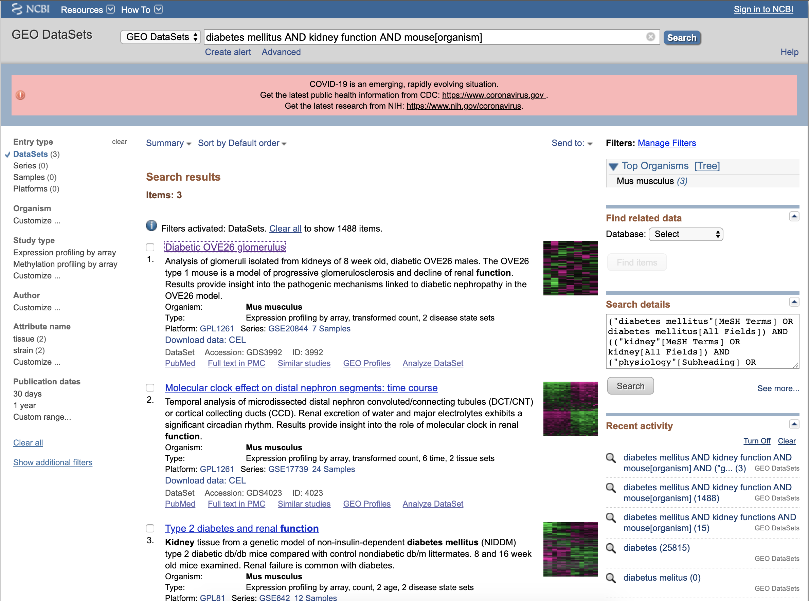

# Introduction to GEO

## Learning Objectives

* Get an idea of what GEO is used for, and how it can supplement research
* Understand the difference between user-submitted and NCBI curated material
* Learn how to construct a GEO query, and download expression data directly to either a local or remote machine

## Summary

<p>

* The Gene Expression Omnibus, also known as GEO, is a large online repository of expression data 
* Primarily composed of user submitted experimental microarray and next-generation sequencing data 
* Also contains permutations of experimental data; curated and expanded upon by NCBI in the forms of GEO Datasets and Profiles
* In addition to functioning as an experimental archive, NCBI provides a robust suite of tools for further analysis and exploration of submitted data

</p>

<p>

GEO integrates the incredibly powerful Entrez query system to assist with parsing through the multitude of records hosted on the site. Building upon that, there are also links embedded which lead to any relevant biomedical literature hosted on PuBMed, original sequence files located in the Sequence Read Archive (SRA), and to any other of the 39 repositories maintained by NCBI.

</p>

## Getting Started

**When working with NCBI, it's important to have an account and to be signed in**
* By doing so, your search history is saved and you're afforded considerably more compute when working with any databases API, among a plethora of other benefits, including suggested queries
* If you plan on submitting data to GEO, or other data repositories, you're required to sign in anyway, so it's a good practice to get into


You'll notice that the GEO homepage is roughly divided into 4 components:
* Getting Started
  * provides an overview of GEO as a whole, as well as DataSets, Profiles, and how to build queries and download data
* Tools
  * includes utilities and sites for querying DataSets, Profiles and Documentation, as well as guides on on working with the API and FTP site
* Browse Content
  * in a nutshell, a repository browser broken up into the types of submitted content on GEO (DataSets, Series, Platforms, and Samples)
* Information for Submitters
  * various guidelines and standards required for the submission of data to the GEO repository

#### 

## Content Breakdown

<p>

### Data stored in GEO is broken up into two main components:

* Original user-submitted records (in the form of Platform, Sample, and Series)
* Curated records (DataSet, and Profile)

#### The user-submitted material is fairly straightforward: 

* Platform records contain summaries of sequencer or arrays used
  * Can reference many Samples
* Sample records describe all the conditions surrounding how a singular sample was handled, the treatment that was applied to it, and abundance measurements
  * Can only reference one Platform, but can exist in multiple Series
* Series records bring together a group of related Samples and provides a central point and description of the study 
  * Can contain tables describing extracted data, summary conclusions, and/or analyses

#### Curated records are a bit more involved: 

* DataSets make up the NCBI curated collection of GEO samples that are both statistically and biologically comparable
  * Samples contained in a Dataset will all point to the same Platform, meaning they have a similar set of elements
  * Background data processing and normalization are uniform across the whole dataset
  * While you can look for Series and DataSets through the GEO Datasets interface, only Datasets come bundled with advanced data display and analysis tools
  * Because of a backlog in the generation of DataSets, not every Series has an accompanying DataSet record
* Profiles are derivatives from DataSet, and are comprised of gene expression measurements
  * Made up of expression measurements for an individual gene over all Samples that exist in a DataSet

</p>
  
### GEO Datasets
* Built from user submitted records, including Series, Samples, Platforms
* Also stores curated gene expression + molecular abundance data put together by NCBI
* Records additionally contain resources and tools, such as clustering utilities and multi-sample comparison

#### GEO Dataset Results page:



* Title of each individual dataset lists either the Dataset (GDS), Series (GSE), or Platform (GPL) accession number
* Followed by Title, and Organism in brackets
* Underneath Accession number are quick links to the GEO Profiles, PMC text, and tools for analysis
* Clicking the main title brings you to the Dataset Record

#### GEO Dataset Records page:


* Main record contains descriptive information about the dataset (organism, platform, sample values + number)
* Next to the record, the Expression Profiles link takes you to the GEO Profiles page
* Cluster Analysis to the right brings you to the requisite heatmap
* Under that are options to download various files containing additional Dataset information, experimental variable subsets, etc
* At the bottom are additional data analysis tools for finding genes, comparing sets of samples, generating heatmaps, and examining experimental design + value distributions.

### GEO Profiles
* A derivative of Geo Datasets
* Stores *individual* curated gene expression + molecular abundance profiles
* Assembled and sourced from GEO microarray data
* Queries based upon gene annotation / profile characteristics

#### GEO Profile Results page:


* Lists Dataset accession (GDS) from where the profile is derived from
* Platform accession (GPL) that the Dataset is based on + unique ID from record
* Organism
* Additionally, contains:
  * Annotation: gene symbol, full name + aliases
  * Reporter: Original sequence reporter(s) taken from the Platform record supplied by submitter
  * Experiment: Dataset from where the profile comes from

#### GEO Profile Chart page:


* By clicking on the little chart thumbnail, the full profile details are enlarged
* This expanded chart include more comprehensive details, such as expression values and experimental design
* Explaining the graph:
  * Each column you see represents the expression measurement that was extracted from the VALUE column of the Sample record
  * Original Sample accessions are listed below (GSM)
  * Something to note: The values associated with each accession have undergone processing and normalization that is not uniform across accessions.
  * Because of this, the values should be considered arbitrary, and direct comparisons between different Datasets may not be accurate.
  * The square represent rank order of expression measurements, and indicate where the expression of that gene falls in comparison to all other genes on an array.

#### GEO Sample Accession


* Selecting a Sample in the Profile Chart brings you to it's appropriate GEO Accession page
* Here, you can view tons of relevant information in regards to the singular Sample including: 
  * Sample type
  * Source name
  * Organism
  * Various characteristics
  * Protocols used for Treatment, Growth, Extraction, etc
* Also includes the Platform ID (GPL) and Series ID at the bottom
* You also have the option to download raw Sample specific CEL data, either through a web browser, or through FTP

## Contact

If you have questions about the information in this workshop document, please contact:

```
Nathaniel Maki
Bioinformatics Research Training Specialist
MDI Biological Laboratory
nmaki[at]mdibl.org
```


