# Introduction to GEO

## Learning Objectives

* Become familiar with what GEO is used for, and how it can supplement research
* Understand the difference between user-submitted and NCBI curated material
* Learn how to construct a GEO query, and download expression data directly to either a local or remote machine

## Summary

* The Gene Expression Omnibus, also known as GEO, is a large online repository of expression data 
* Primarily composed of user submitted experimental microarray and next-generation sequencing data 
* Also contains permutations of experimental data; curated and expanded upon by NCBI in the forms of GEO Datasets and Profiles
* In addition to functioning as an experimental archive, NCBI provides a robust suite of tools for further analysis and exploration of submitted data
* Records include embedded links which lead to relevant biomedical literature hosted on PuBMed

## Logging in / Creating an NCBI Account

#### Having an NCBI account greatly increases the flexibility of the tools and resources at your disposal.

* This includes working with NCBI's programming API:
  * With a verified account, your API calls are not throttled, and you're afforded more compute than if you were to remain anonymous
* Assists in searching for and submitting through NCBI:
  * Saving of search strategies and queries built through PubMed and other repositories
  * You're required to have an account for data submission
* To sign in/create an account, click this [link](https://www.ncbi.nlm.nih.gov/account/?back_url=https%3A%2F%2Fwww.ncbi.nlm.nih.gov%2F)

## Platform Overview

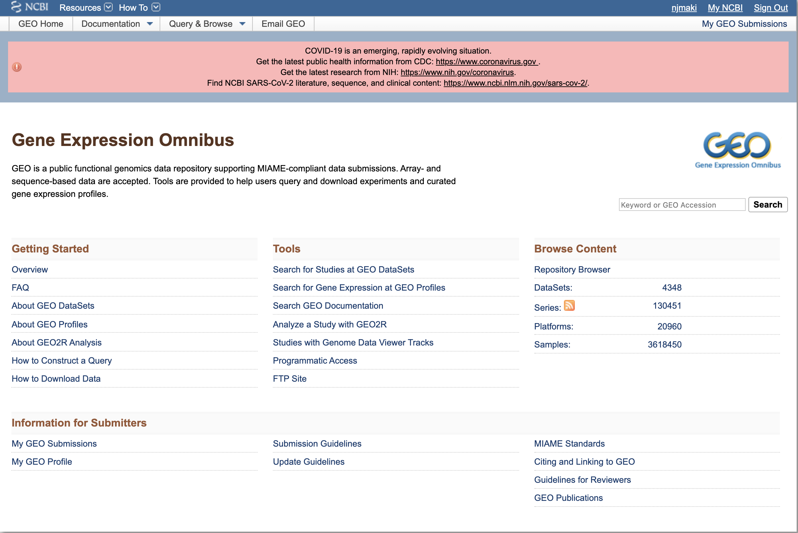

The GEO homepage is comprised of 4 components:
* Getting Started
  * Provides an overview of GEO as a whole, as well as DataSets, Profiles, and how to build queries and download data
* Tools
  * Includes utilities and sites for querying DataSets, Profiles and Documentation, as well as guides on on working with the API and FTP site
* Browse Content
  * Repository browser broken up into the types of submitted content on GEO (DataSets, Series, Platforms, and Samples)
* Information for Submitters
  * Various guidelines and standards required for the submission of data to the GEO repository

## Content Breakdown

* Original user-submitted records
  * Platform
  * Sample
  * Series
* Curated records
  * GEO DataSet
  * GEO Profile

## User-Submitted records

### Platform

* Platform records contain summaries of sequencer or arrays used
* May reference many Samples that have been submitted by multiple submitters
* GEO accession number (GPLxxx)

 

#### Example Platform Record


### Sample

* Sample records describe all the conditions surrounding how a singular sample was handled, the treatment that was applied to it, and abundance measurements
* May only reference one Platform, but can exist in multiple Series
* GEO accession number (GSMxxx)

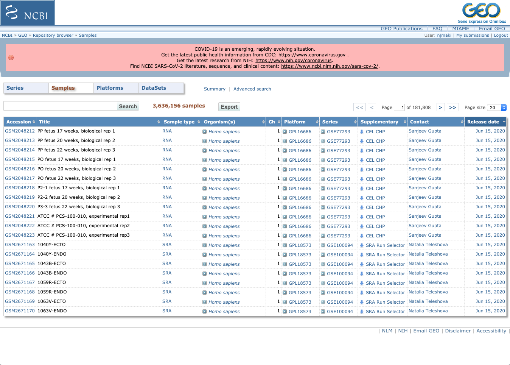

#### Example Sample Record


### Series

* Original, submitter-supplied record summarizing an experiment
* Series records bring together a group of related Samples and provide points of observation and a description of the study 
* May contain tables describing extracted data, summary conclusions, and/or analyses
* GEO accession number (GSExxx)

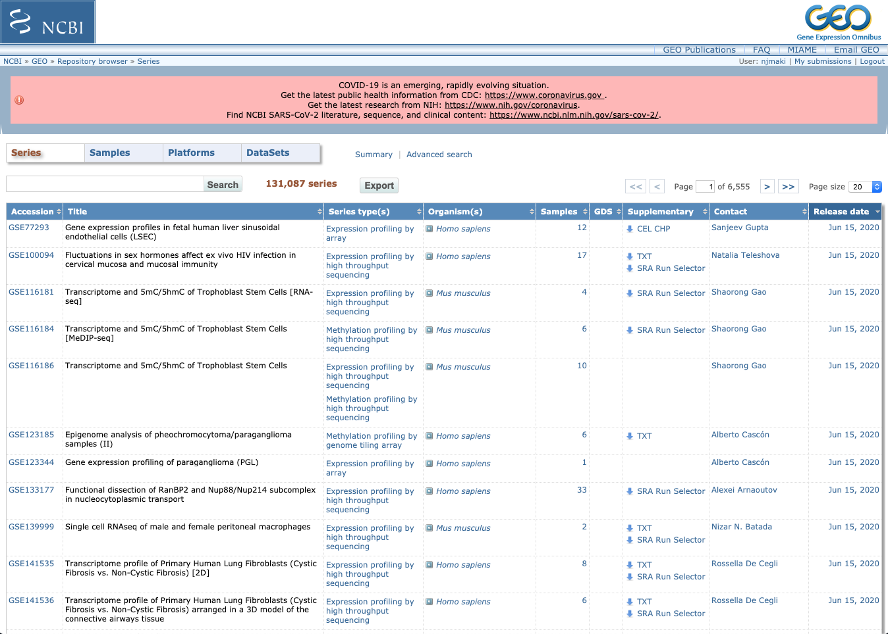

#### Example Series Record

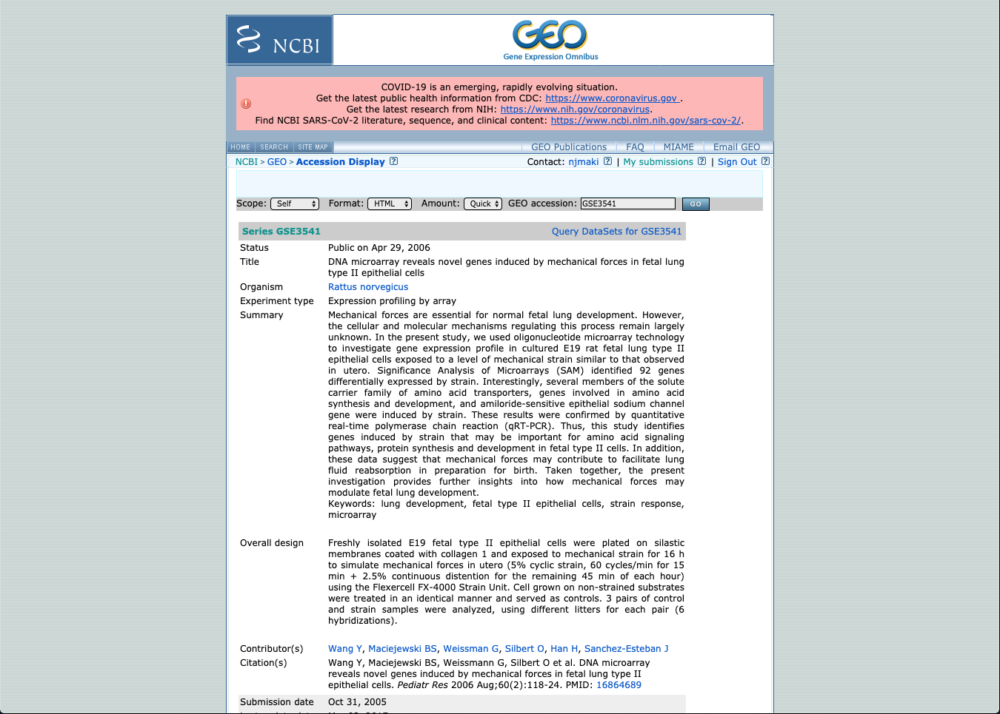

## Curated records 

### GEO DataSet

* Built from user submitted records of Series, Samples, and Platforms
  *  Include gene expression + molecular abundance information
* Encompass the NCBI-curated collection of GEO samples that are both statistically and biologically comparable
  * Samples contained in a DataSet will all point to the same Platform, due to their similar set of elements
  * Background data processing and normalization are uniform across the whole DataSet
* DataSet records contain resources and tools for further analysis, including clustering utilities and multi-sample comparisons
* Because of a (massive) backlog in the generation of DataSets, not every Series has an accompanying DataSet record

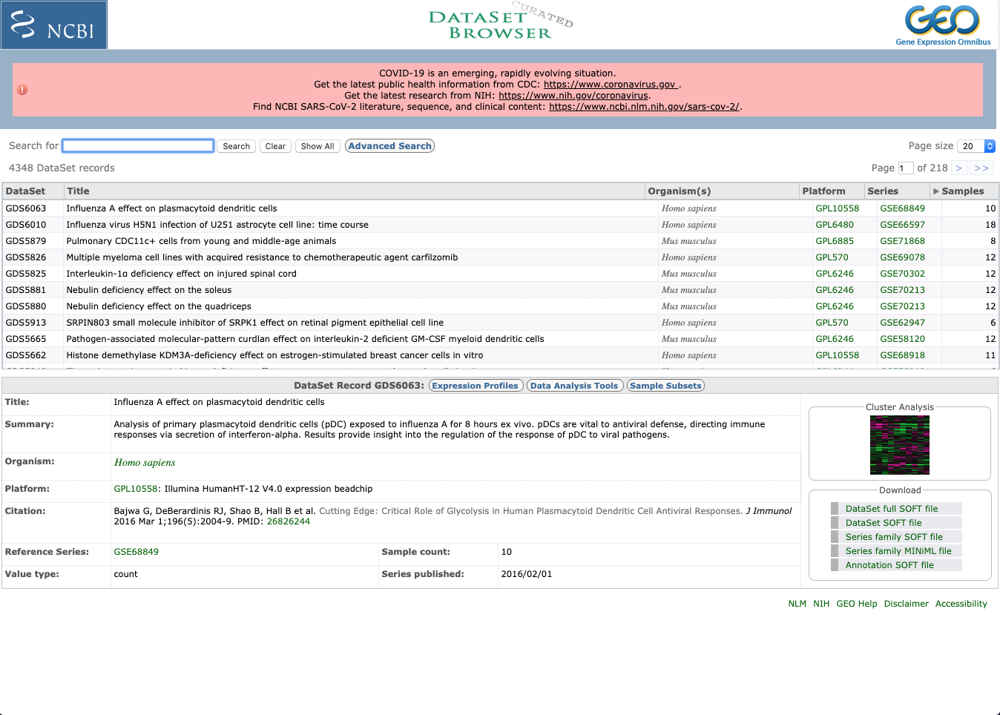

## Searching GEO

**NCBI integrates its Entrez search system across all repositories. This means that while sometimes graphically divergent; building queries, locating search history, and finding related material will be functionally identical and uniform across platforms**

GEO offers both `general` and `advanced` query functionality

### General Search

* To General search, type content into the `Search` box on the GEO Datasets front page and hit enter
* While easy to use, a general search will often give you an overwhelming number of results


* To refine your query, you can use the `Advanced Search` button
  * Selecting `Advanced Search` brings you to another GEO Datasets page

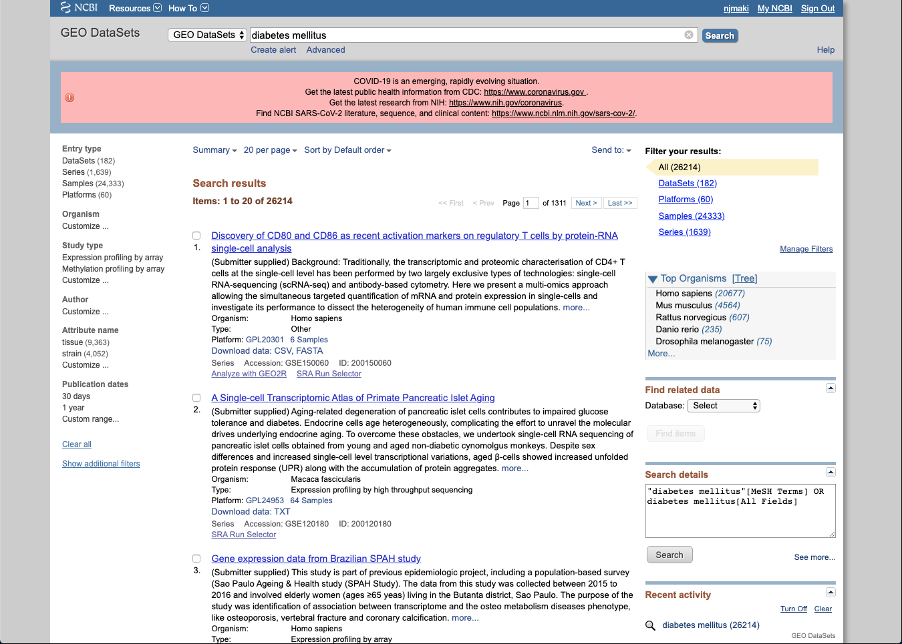

* This lists *everything* related to your search query. To refine to Datasets, choose `DataSets` from the `Entry type` column on the left side of the page

### Advanced Search

* Advanced search is a bit more involved, but still fairly easy to use
* To access the `Advanced Search` builder, select `Advanced` under the general search bar

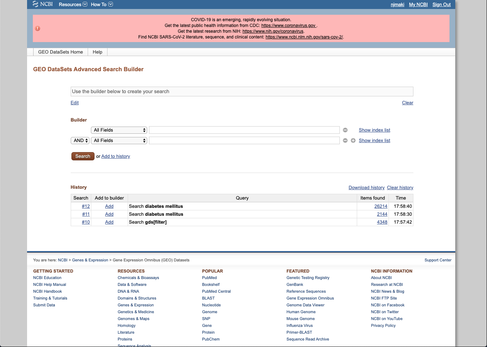

* To build a search query, first you need to `Add terms to the query box`
  * The dropdown menu gives you a large number of fields to choose from, which can be further refined by the terms entered
  * There is also an autocomplete feature built in that helps avoid spelling mistakes, and expands functionality


* Refine your advanced search to only DataSets by choosing `DataSets` from the `Entry type` column on the left side of the page

#### GEO DataSet Results

* After refining, choose a DataSet to examine
* Each DataSet record has a descriptive title with a description, followed by additional record-specific data
* Underneath Accession number are quick links to related GEO Profiles, PubMed citation page, PMC free full-text articles, and tools for analysis
* Selecting the main title brings you to the specific DataSet Record page

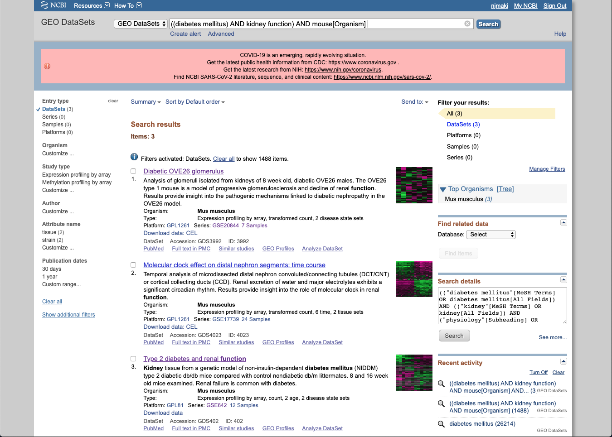

#### GEO DataSet Records

* The main record contains descriptive information about the DataSet (organism, platform, sample values + number)
* Next to the record, the Expression Profiles link takes you to the GEO Profiles page
* Cluster Analysis to the right brings you to the requisite heatmap
* Under that are options to download various files containing additional DataSet information, experimental variable subsets, etc
* At the bottom are additional data analysis tools for finding genes, comparing sets of samples, generating heatmaps, and examining experimental design + value distributions.

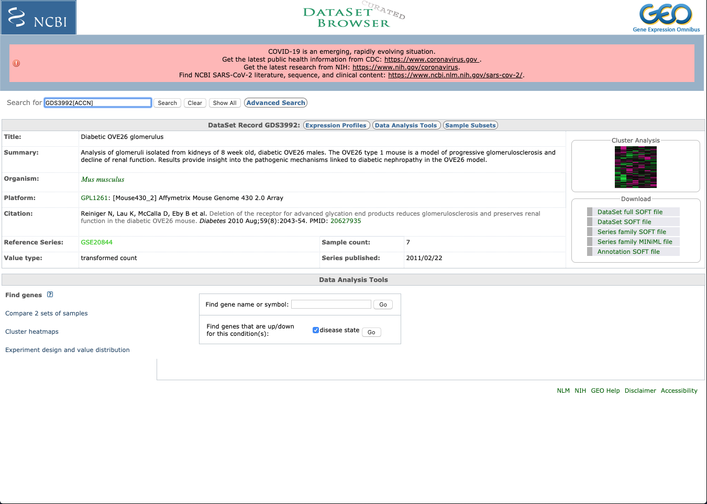

### GEO Profile 

* Profiles are derivatives from DataSets, and are comprised of gene expression measurements for an individual gene over all Samples that exist in a DataSet
* Store *individual* curated gene expression + molecular abundance profiles
* Assembled and sourced from GEO microarray data
* Queries based upon gene annotation / profile characteristics


#### GEO Profile Results

* Lists DataSet accession (GDS) from where the profile is derived from
* Platform accession (GPL) that the DataSet is based on + unique ID from record
* Organism
* Additionally, contains:
  * Annotation: gene symbol, full name + aliases
  * Reporter: Original sequence reporter(s) taken from the Platform record supplied by submitter
  * Experiment: DataSet from where the profile comes from


#### GEO Profile Chart

* By clicking on the little chart thumbnail, the full profile details are expanded
* This chart includes comprehensive information such as expression values and experimental design
* Each column you see represents the expression measurement that was extracted from the VALUE column of the Sample record
  * Original Sample accessions are listed below (GSM)
* Something to note: The values associated with each accession have undergone processing and normalization that is not uniform across accessions.
  * Because of this, the values should be considered arbitrary, and direct comparisons between different Datasets may not be accurate.
  * The squares represent rank order of expression measurements, and indicate where the expression of that gene falls in comparison to all other genes on an array.

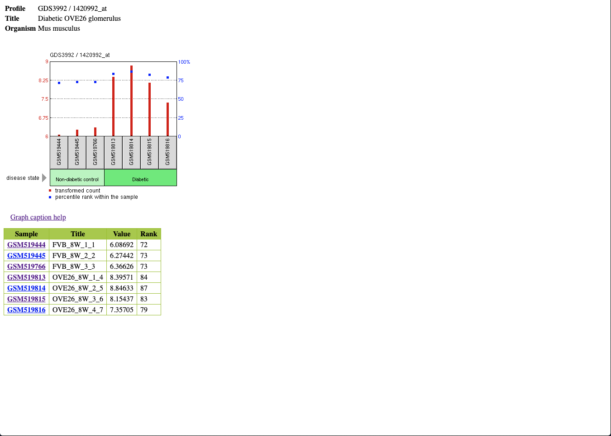

#### GEO Profile Sample Accession

* Selecting a Sample in the Profile Chart brings you to it's appropriate GEO Accession page
* Here, you can view tons of relevant information in regards to the singular Sample including: 
  * Sample type
  * Source name
  * Organism
  * Various characteristics
  * Protocols used for Treatment, Growth, Extraction, etc
* Also includes the Platform ID (GPL) and Series ID at the bottom
* You also have the option to download raw Sample specific CEL data, either through a web browser, or through FTP


## Downloading GEO Data with FTP

* NCBI provides you with a plethora of options to download GEO data. We'll touch on the FTP site briefly

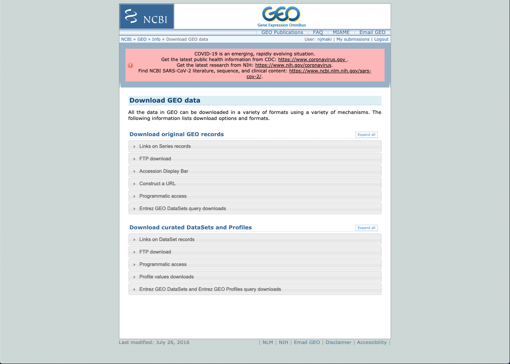

* Almost all data queried or interacted with on NCBI can be direct downloaded from the FTP site, using an index location and command line programs such as `curl` or `wget`

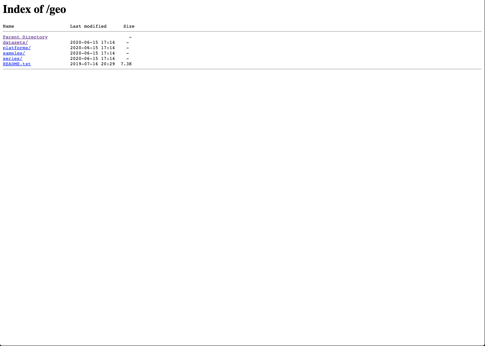

## Contact

If you have questions about the information in this workshop document, please contact:

```
Nathaniel Maki
Bioinformatics Research Training Specialist
MDI Biological Laboratory
nmaki[at]mdibl.org
```


