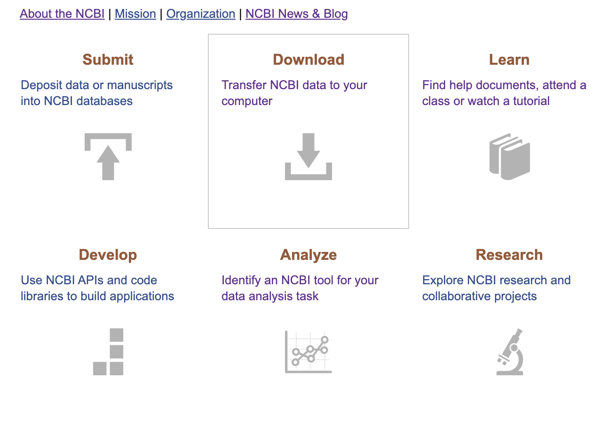

## Learning Objectives
* Acquire a basic understanding of the NCBI website, its resources, and its most commonly used utilities/tools
* More specifically, become familier with Pubmed, GEO, BLAST, and briefly SRA
* Exposure to future and upcoming tools/resources under active development, such as NCBI Datasets, NCBI Virus Repository, BLAST+, REMAP, NIH Strides, and the RAPT pipeline

## So, what exactly is the NCBI?
* National Center for Biotechnology Information
* Three main focuses:
* Maintain a vast repository of data, generated by researchers from all over the world
  * GEO, SRA
* Develop tools, utilities, and software for procuring available data, and for performing analysis
  * BLAST, SRA-toolkit, RAPT
* Provide a web interface for interacting with, manipulating, and querying said data

In addition the the above, they also produce training materials to assist in orienting students, fledgling researchers, and seasoned PIs to the tools/resources at their disposal. 

The following [Link](https://www.ncbi.nlm.nih.gov/home/learn/) will take you to the NCBI education page.

## Front Page, Explained

The front page of NCBI acts as a hub of sorts, with the main source of navigation being the search bar, and dropdown menu beside it. At the top left of the page are quick links to resources available, as well as grouped tutorials covering common use cases.

Selecting BLAST will take you to the tools' homepage:

By contrast, the dropdown menu:

Selecting Data and Software has some useful tutorials right off the bat:

Clicking the how-to guide on downloading the complete genome of an organism takes you to the FTP intro page:

**This is something that will be covered and expanded upon in a separate tutorial, but by all means, if you'd like to jump ahead feel free**

Bringing us back to the front page:

The resources column on the left brings you to a more comprehensive list of available tools (for say, Data + Software). It's a bit confusing having two sections of the main page refering to resources, and is something that's being unified when they finish revamping the site.

On the right hand side are popular resources within the NCBI site. You'll notice that a few of the mentioned above subjects are included in this list.

## Core of NCBI: The Entrez Query
Entrez acts as the primary method of executing text queries and retrieval.
It integrates the entire PubMed library of related biomedical literature with a myriad of other relevent literature and moleculare databases. These libraries include:
* DNA + protein sequence
* structure
* gene
* genome
* genetic variation
* gene expression

It can be a bit daunting to use at first, and general searches can leave you with an overwhelming number of results. I'll be showing you how to structure your queries in such a way, as to take advantage of Entrez's flexible and powerful filter functions.

For every database that is available, there are particular and specialized fields that can be used to help refine your results. 

* It's worth mentioning here that if you haven't yet, creating an NCBI account greatly increases the flexibility of the tools and resources at your dispolal through this site.
  * A simple example being in working with NCBI's Entrez Programming Utilities:
  * With a verified account, your database calls are not throttled, and you're afforded more compute than if you were to remain anonomyous.

Additionally, Entrez integrates relevent data between databases. This means that if you are examining a GEO profile of some experiment, a link to the appropriate SRA page will be included (and vice versa)

### Select Entrez Databases
i.e, what is GEO, SRA??

To be specific, Entrez encompasses 39 molecular and literature databases. Of coures, we're not going to be covering them all, but imo, the most relevant for this tutorial are:
* GEO Datasets
* GEO Profiles
* PubMed + PubMed Central
* SRA

