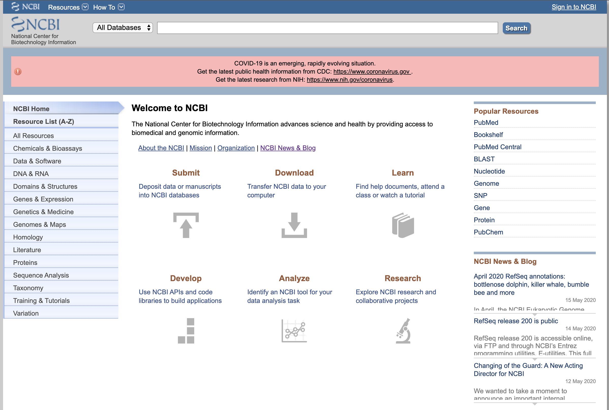
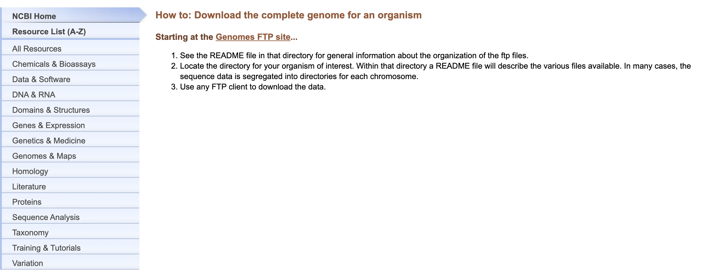
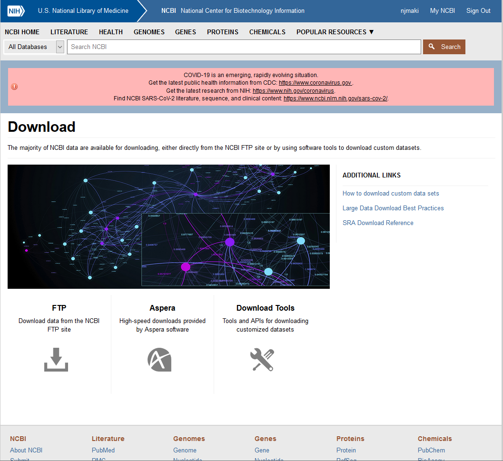
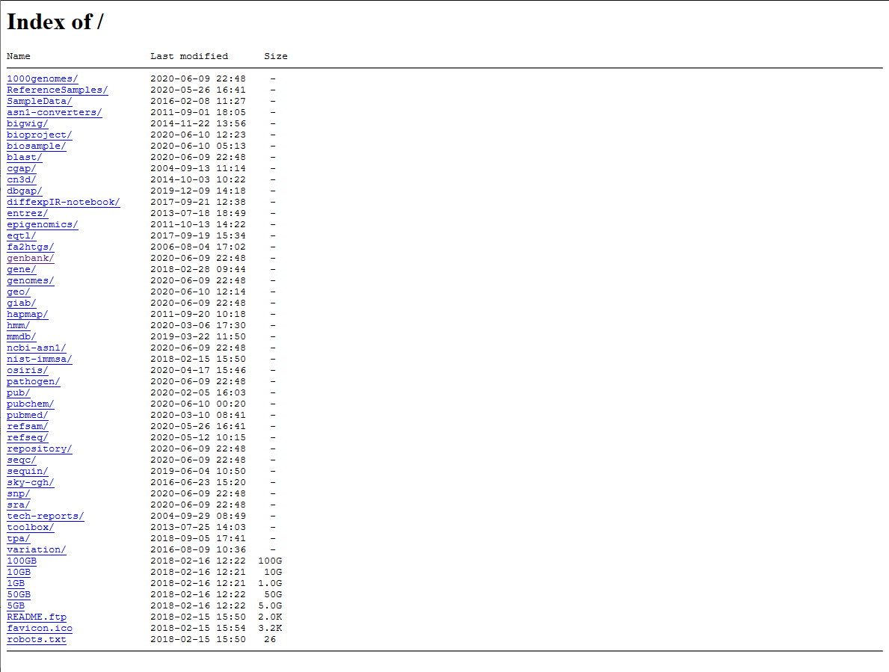

# Introduction to NCBI

## Learning Objectives

* Acquire a basic understanding of the NCBI website, its resources, and its most commonly used utilities/tools
* More specifically, become familiar with Pubmed, the Gene Expression Omnibus (GEO), BLAST, Genbank, and SRA
* Exposure to future and upcoming tools/resources under active development, such as NCBI Datasets and the NCBI Virus Repository
  
## Summary

* NCBI stands for The National Center for Biotechnology Information, and has three primary focuses
* Maintain a vast repository of data, generated by researchers from all over the world
  * Reflected through databases such as GEO, SRA, etc
* Develop tools, utilities, and software for procuring available data, and for performing analysis
  * BLAST, SRA-toolkit, RAPT
* Provide a web interface for interaction, data submission, and and constructing data queries

In addition the the above, NCBI also produces training materials to assist in orienting students, fledgling researchers, and seasoned PIs to the tools/resources they offer. 

#### Training material can be found [here](https://www.ncbi.nlm.nih.gov/home/learn/)

## Logging in / Creating an NCBI Account

#### Having an NCBI account greatly increases the flexibility of the tools and resources at your disposal.

* This includes working with NCBI's programming API:
  * With a verified account, your API calls are not throttled, and you're afforded more compute than if you were to remain anonymous
* Assists in searching for and submitting through NCBI:
  * Saving of search strategies and queries built through PubMed and other repositories
  * You're required to have an account for data submission
* To sign in/create an account, click this [link](https://www.ncbi.nlm.nih.gov/account/?back_url=https%3A%2F%2Fwww.ncbi.nlm.nih.gov%2F)


## Platform Overview



The front page of NCBI acts as a hub, with the main source of navigation being the Entrez search bar, and the database selection menu to the left, and popular resources on the right. 

On the right side of the page are popular resources within the NCBI site.

Content in the center is comprised of links to the main functions of the NCBI site

* Submit: NCBI Submission Portal, for uploading data to their online repositories
* Download: use FTP to bulk download data from NCBI directly to your local machine
* Learn: location for educational materials/tutorials/etc
* Develop: tools and resources for software/web developers, link to NCBI Github repo
* Analyze: find a tool for manipulating, aligning, visualizing, and evaluating biological data
* Research: current tools and basic research topics being worked on by the NCBI Computational Biology branch

At the top left of the page, under the label `Resources`, are links to grouped tools and data repositories 


Specifically selecting BLAST will take you to the tools' homepage:


For a comprehensive list of all resources, select `All Resources` under the `Resources` drop-down menu


Tutorials for many facets of NCBI are under the `How-To` menu


For guides on common tool use-cases, select `Data and Software`:


Selecting `Download the complete genome for an organism` will take you to a walkthrough of how to use the FTP site:



## Entrez Advanced Search

The Entrez search tool is NCBI's primary method of executing text queries and retrieval.
It integrates the entire PubMed library of related biomedical literature with a myriad of other relevant literature and molecular databases. These libraries include:
* DNA + protein sequence + structure
* gene
* genome
* genetic variation
* gene expression

General searches can leave you with an overwhelming number of results; by using the Entrez search function, you can refine your output to a manageable degree.

NCBI integrates relevant data between databases, meaning if you are examining a Gene Expression Omnibus (GEO) Dataset, a link to the appropriate Profile page is included.

As this is just an introduction to NCBI, a guide to building queries with Entrez will follow in a separate tutorial.

## Commonly used NCBI Databases

### Gene Expression Omnibus (GEO)

 

* Large online repository of expression data
* Primarily composed of user submitted experimental microarray and next-generation sequencing data
  * Original records stored in the form of Platforms, Samples, and Series
* Also contains permutations of specific experimental data
  * Curated and expanded upon by NCBI in the forms of GEO Datasets and Profiles
* In addition to functioning as an experimental archive, NCBI provides a robust suite of tools for further analysis and exploration of submitted records

### Sequence Read Archive (SRA)


* Vast online archive for raw sequence data
* Contains sequencing data from most NGS platforms (Illumina, Roche, etc)
* Largest publicly available repository of High Throughput Sequencing (HTS) data
* Accompanied by SRA-toolkit suite for acquisition + dumping of data from SRA database to local and remote machines

### Genbank


* Annotated collection of all publicly available nucleotide sequences, along with their protein translations
* Genbank records contain detailed information related to the organism under observation
  * Relevant References, with PubMed accession IDs and Authors included
  * Gene (region of biological interest in record)
  * Coding sequence (CDS)

### PubMed + PubMed Central


* Biomedical Literature database
* Includes citations + abstracts, from biomedical journals such as Nature, Medline, etc
* **PubMed** is primarily a biomedical reference source
  * Full-text articles are locked behind a paywall
* **PubMed Central (PMC)** contains full-text versions of articles for free
* If available, PubMed will link to PMC for appropriate article

## Commonly used NCBI Site Utilities

### BLAST


* Searches for areas of similarity between sequences
* Compares various nucleotide or protein sequences to sequence databases, and calculates statistical significance of matches
* Can determine functional + evolutionary relationships between sequences
* Identify members of gene families
* Can be ran through a web browser, referenced in external code, installed locally, or executed in a cloud environment through BLAST+ (AWS, Azure, etc)
* There also exist many searches that have been tweaked for specific use cases, such as: 
  * CD-search, which locates conserved domains in the submitted sequence
  * Primer-BLAST, which allows you to design primers that are specific to a PCR template

### Downloading + FTP



#### Almost all data queried or interacted with on NCBI can be direct downloaded from the FTP site, using an index location and programs such as `curl` or `wget`.



#### Additionally, there are suites of tools for general data access (Entrez Programming Utilities) and ones that are repository specific (SRA Toolkit, GEO2R), though some require software to be installed locally before use.

## Under Development

### NCBI Datasets (Beta)


* Resource that NCBI is developing for locating and building datasets
* Allows for bulk downloading of genome sequence as well as matching annotation
* For now, web interface only works with Eukaryotic organisms
* A Command Line Interface (CLI) is needed for all other organisms
* As it's still being worked on, content is fairly light 
  * For example, searching for *Mus musculus*, will present you with only a couple reference genomes, and a single available annotation
* As this resource expands, expect usefulness to mature as well

### NCBI Virus (Beta)


* Aggregate repository for viral sequence data originating from GenBank, Refseq, and other NCBI repositories
* Includes visualized graphic(s) for taxonomy of viruses, discriminating between hosts
* Relevant for today, you can find a link under `Find Data` labeled `Up-to-date-SARS-Cov2`
  * Links to a page dedicated to COVID-19 research and literature
* Here you can browse vast amounts of nucleotide and protein data, locate relevant PubMed and PMC articles, perform in-place alignments, and construct phylogenetic trees

## Contact

If you have questions about the information in this workshop document, please contact:

```
Nathaniel Maki
Bioinformatics Research Training Specialist
MDI Biological Laboratory
nmaki[at]mdibl.org
```