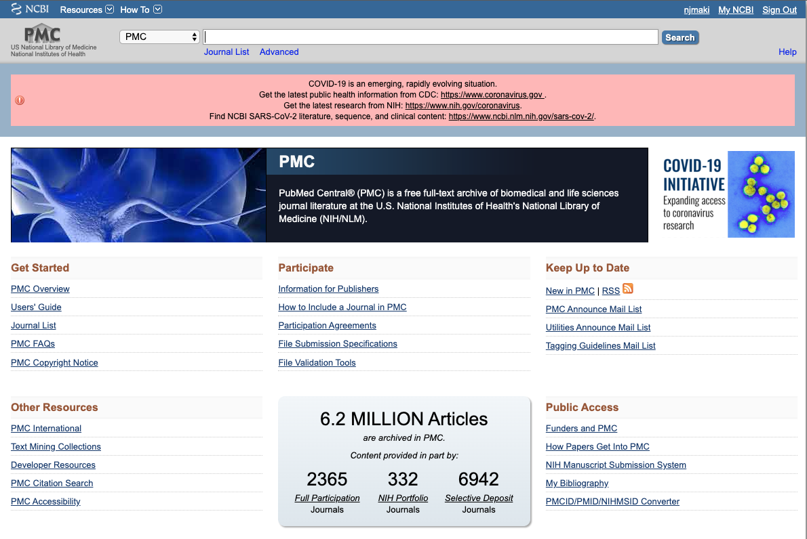
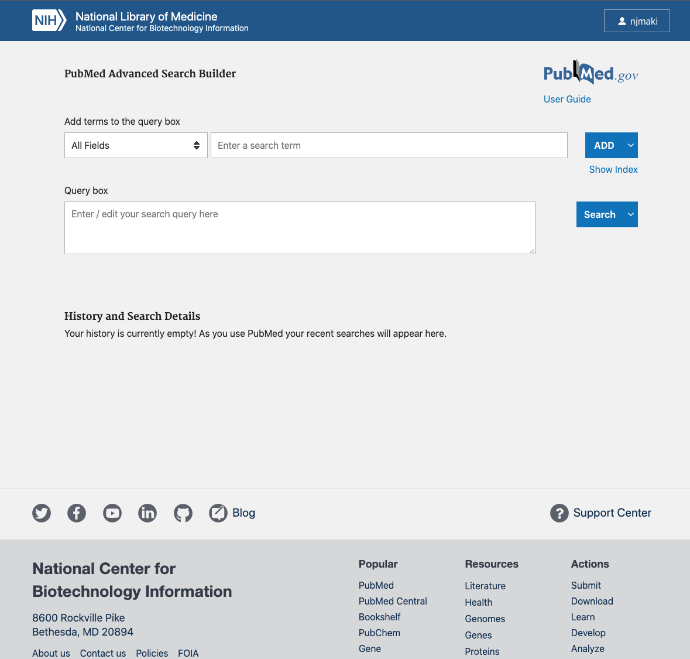
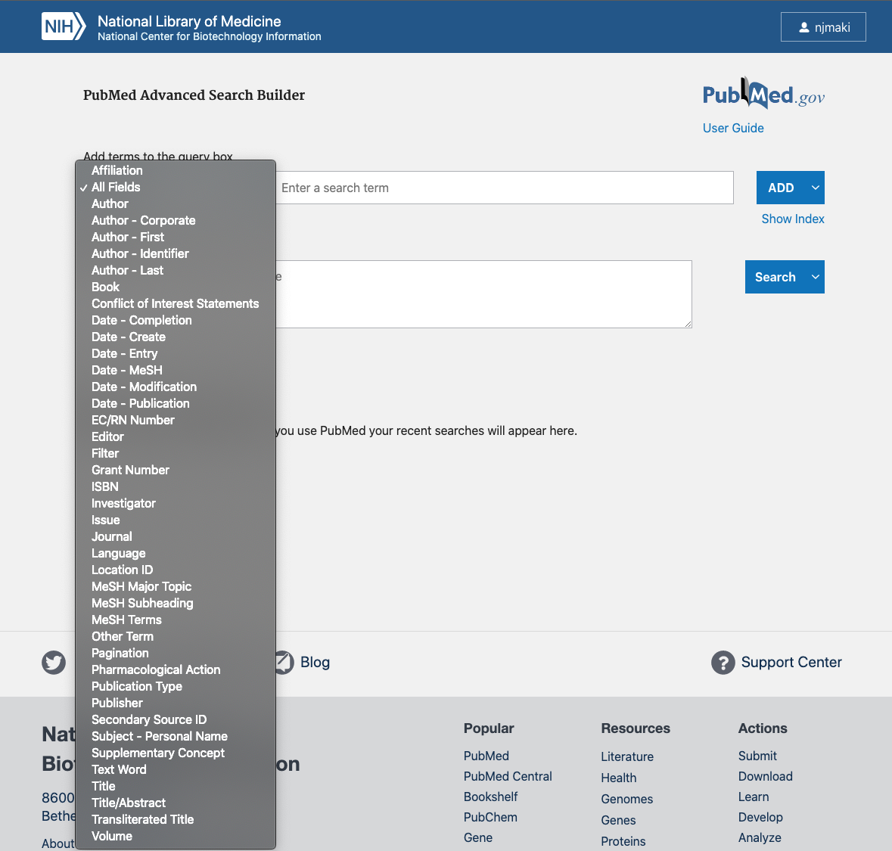
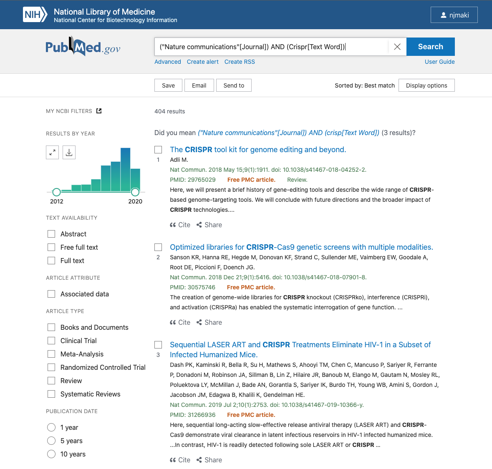

# Introduction to PubMed

## Learning Objectives

* Become familiar with accessing and navigating PubMed/PMC
* Use the General search and Advanced search builder to locate relevant literature

## Summary

* PubMed is a freely available literature resource, with content focused primarily on biomedical and life sciences research
* Comprised of over 30 million abstracts and citations
* Full text articles are not always available, though links are provided to publisher sites and/or PubMed Central (PMC)


## Core Content

* PubMed draws from three main sources for citations and literature
  * MEDLINE
  * PMC
  * BookShelf

### MEDLINE

* US National Library of Medicine (NLM) primary bibliographic database, containing over 25 million references to journal articles with a focus on biomedicine
* Most of PubMed references are acquired from this source
* A fair number of citations in MEDLINE are being updated with links to the free full text articles, archived in PMC
* If full text is not available through PMC, you can use the `Loansome Doc` feature to "borrow" the article through the National Network of Libraries of Medicine

### PubMed Central (PMC)

* Free full-text archive of biomedical and life sciences journal literature, managed by NCBI
* Contains over 5 million full text records, with literature dating back to as late as the 1700s
* If a full text article exists in a PubMed record, often it will include a link to a sibling PMC page
* Through the NIH Preprint Pilot (as of June 2020), includes preprints that are the result of research funded by National Institutes of Health
  * Currently focused on preprints relating to SARS-CoV-2 virus and COVID-19



### Bookshelf

* Online archive that provides free access to books and documentation in the healthcare and life science fields
* Differentiates itself from PMC and MEDLINE by the depth of the content available


## Searching PubMed

PubMed offers both `general` and `advanced` query functionality

### General

* To General search, type content into the `Search` box on the front page and hit enter
  * Depending on what you looked for, PubMed, using a machine learning algorithm, will do its best to find the most relevant citation(s)
  * While easy to use, a general search will often give you an overwhelming number of results


* You can use the filters on the left to help refine your records
* Once you've selected an entry:


* Notice the `Full Text Links` button, that will take you to the publisher page, where the full article is freely available to access
* You can use the `Page Navigation` links on the right to find similar articles and additional resources

### Advanced

* Advanced search is a bit more involved, but still fairly easy to use
  * To access, just click the `advanced` button below the search bar



* To build a search query, first you need to `Add terms to the query box`
  * The dropdown menu gives you a large number of subjects to choose from, which can be further refined by the terms entered
  * There is also an autocomplete feature built in that helps avoid spelling mistakes, and expands functionality



* You can also modify how these terms are interpreted by using boolean operators


* Once you've entered in all terms, click `Search`



* From here, you can refine your search in the same way that we covered in the `General search` component
* If you go back to the `PubMed Advanced Search Builder` page, you'll notice that near the bottom of the page, your History and Search Details are saved


* When signed in to NCBI, these queries are recorded, and provide a good reference point, should you ever need to revisit for similar content in the future

## Contact

If you have questions about the information in this workshop document, please contact:

```
Nathaniel Maki
Bioinformatics Research Training Specialist
MDI Biological Laboratory
nmaki[at]mdibl.org
```