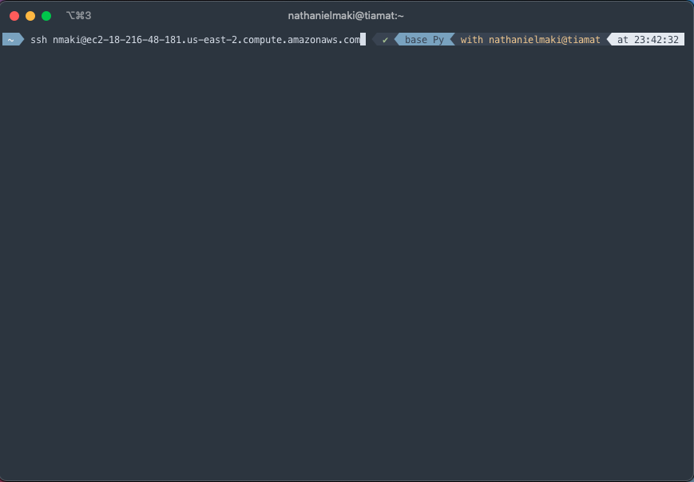
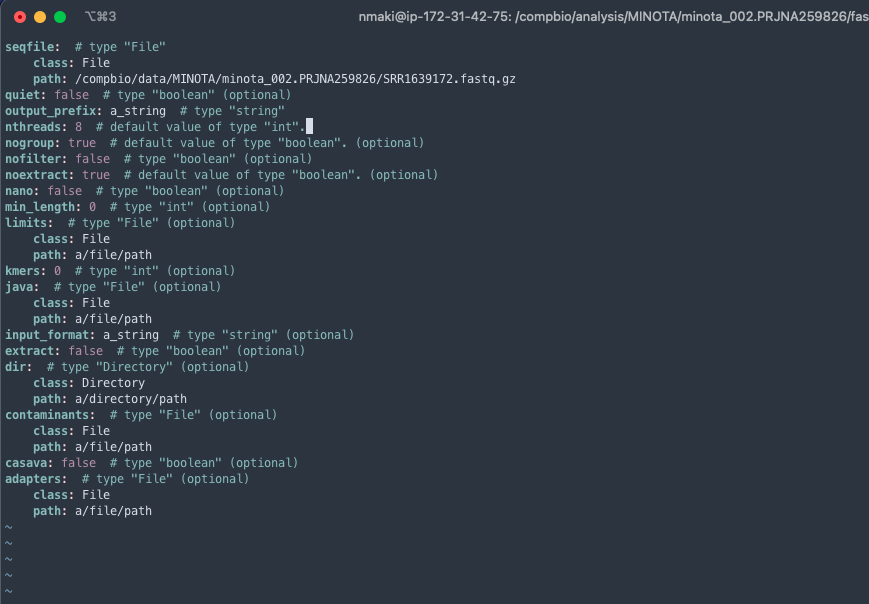
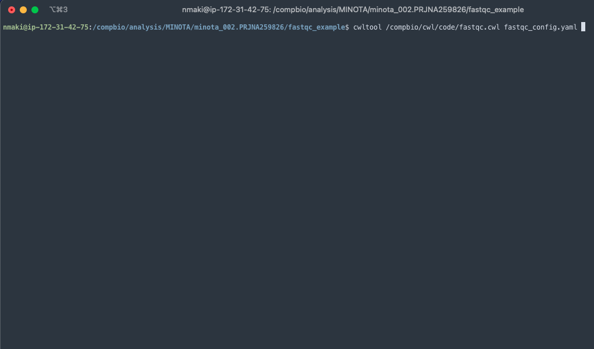

# MINOTA Workshop: Introduction to Quality Control

Welcome to the MDIBL MINOTA Workshop. In this portion of the course, we'll be covering the critical process of Quality Control.
First, a review of some exploratory tools for both pre and post transcriptome analysis, and how they can provide you with an overview of your input data and output results, without having to sift through pages of text log files (as fun as that sounds).

Next, we're taking a look at a couple of software packages that do the heavy lifting, and are chiefly responsible for the Quality Control aspects of QC. Specifically Trimmomatic, in an integrated context within Trinity, and Trim Galore!; a wonderful piece of software built by the developers of FastQC (which is, coincidentally, half of it!).

We'll also touch on the concept of QC'ing your read files before building an assembly

We're going to cover methods for transcriptome quality control, and how to critically examine your assembled output.

Lastly, we'll jump into a quick tutorial on how to use the tools described above to prepare your raw sequence data for assembly.

## Pre and Post Quality Control Assessment

### FastQC

Before you start sending your raw files to the chopping block, it's probably a good idea to see what's actually in them! To that end, enter FastQC.
Developed by Babraham Bioinformatics, FastQC generates a quality report of whatever you throw at it (mostly) (SAM, BAM, FastQ). It's executable both on the command line, and through a GUI (graphical user interface) application, for those of you who'd rather not channel your inner Neo (or maybe just haven't found him yet). 

The report itself is interactive, opened as an HTML webpage, and comes bundled with supplementary graphs and tables (we'll cover these in some detail). It's especially useful to run *before* you conduct QC, as it'll give you a good baseline to compare your reads to after trimming, by highlighting contaminants lurking about. If you're using a trimming tool that requires you to specify the sequence beforehand, this can be a good way to find them and plug them in accordingly.

### MultiQC

If FastQC is the one thing you want to run before you begin an analysis, then MultiQc is the last. Super simple to use, it pieces together a report composed of the aggregate results of all analyses in a given directory. This includes results from FastQC, STAR, Trim Galore!, featurecounts, etc. It's also smart enough to descend into multiple sub-directories, so once you navigate to your root project dir, simply type `multiqc .` and you're golden.

## Trimming

Trimming, in a nutshell, is spring cleaning for your input. It removes unwanted adapters, excises pesky primers and poly-A tails, and scrubs poor quality bases from your sequence file(s). This is especially important because if you allow those components to remain, it may compromise the accuracy of your results downstream. Error-ridden input can lead to unaligned reads, low mapping efficiency, and mismatches between your reads and a transcriptome/reference genome. There are a fair number of tools available, but we're going to focus on Trimmomatic, both in its standalone and Trinity-integrated form, and Trim Galore!.

## Assembly-Specific

What I mentioned above is fairly general; however, there is a specific reason.

First a quick explanation as to how de Bruijn based assembly works: 

* First, a graph is constructed from sequence reads
* Each read is broken down into substrings of some specified length k. Each word of length k is known as a k-mer. In this example, k is set to 5, so here each 5-mer is pulled from the read.
* An ordered list of k-mers is generated by scanning a window of length k across the length of the read (each k-mer overlaps the next by exactly k-1 bases)
* Next, a de Bruijn graph is built by assigning each unique k-mer as a node in the graph, and connecting immediately overlapping k-mers by an edge (which is an effective and compact way of representing the sequence data within the read)
  * for example, hundreds of millions of reads can be sequenced, and the identical sequence regions within reads become compress into individual nodes within the graph
  * In locations where related sequences diverge due to polymorphisms, repeats, splice variations, or sequence errors, the graph will branch, potentially causing bulges or loops

* Each time a branch is formed, the assembler is forced to decide whether or not the path is valid, and what supporting evidence exists to determine its validity.

* Attempting to assemble using low-quality or error-ridden reads will result in many new paths being built, with many being low-count and useless. This is especially true with retention of adapters; your provisional transcripts will be peppered with artificial sequences that don't belong in your final assembly (ensuring that those sequences do not remain is a key selling point of QC).

### Trimmomatic

Trimmomatic is an Illumina-specific read trimming + adapter clipping tool, and functions the same in both its setups (either by itself or bundled with Trinity).

Trimmomatic's default standalone settings are:

`java -jar trimmomatic-0.39 SE -phred33 input.fq.gz output.fq.gz ILLUMINACLIP:TruSeq3-SE:2:30:10 LEADING:3 TRAILING: 3 SLIDINGWINDOW:4:15 MINLEN:36`

* `trimmomatic-0.39` is the version of Trimmomatic being used
* `SE` is the single-end argument (`PE` for paired end)
* `-phred33` is the quality scoring used
* `input.fq.gz` and `output.fq.gz` are your input read file and the name of your trimmed output (for `PE` option, you'd have `input_1.fq.gz`, etc)
* `ILLUMINACLIP:TruSeq3-SE:2:30:10` removes single-end adapters and illumina specific sequences
* `LEADING:3` cuts leading low quality bases, with 3 as the threshold
* `TRAILING:3` does the same(though with trailing)
* `SLIDINGWINDOW:4:15` scans the read with a window 4 bases wide, excises when quality per base dips below 15
* `MINLEN:36` drops reads that are below 36 bases in length

### Trim Galore!

Trim Galore! runs a trimming tool (Cutadapt) and follows it up with building a FastQC report on the output.

First, Cutadapt trims your read files, in much the same way as Trimmomatic, removing adapter sequences primers, unwanted poly-A tails, and low quality transcripts.
Then, FastQC is executed on the trimmed reads, building a report for your output. Trim Galore! also comes bundled with a standard 13bp Illumina adapter, working for PE libraries as well as SE.

### Which Should You Choose?

If you plan on using Trinity as your transcriptome assembler, it's easiest to simply enable the Trimmomatic option `--trimmomatic` (and it's been optimized for that specific use case). You can always run MultiQC on your output down the line to get your trimmed QC report. Additionally, you can modify the Trinity Trimmomatic defaults to you hearts content by using the `--quality_trimming_params` flag and setting them accordingly.

If you're using another assembler such as RNASpades, or SOAPdenovo-Trans, Trim Galore! may be the more convenient option. Though, there's nothing stopping you from replicating Trinity's Trimmomatic settings on the standalone version, and running MultiQC at the end. I would argue that at that point it's up to personal preference. 

## Assessing Transcriptome Assembly Quality

There are a few keys ways to determine the quality of your assembled transcript (basically, how seamless did you build the assembly)?

* Looking at the RNA-seq read representation of the assembly, with the goal being to have ~80% of input reads being present in your assembly. The reads that are left unassembled potentially point to transcripts that are lowly expressed, and without enough coverage to assemble. They may also be of lower-quality, and had slipped through the nimble fingers of trimmomatic
* Comparing the assembly against a database of known protein sequences (swissprot, etc), looking for representation of protein-coding genes
* Examine completeness based on conserved ortholog content through BUSCO
* Use TransRate to statistically analyze your transcriptome assembly

## Preparing Sequence Data for Assembly

Welcome back to the MINOTA Workshop! This is the second portion of the quality control module, and consists of guided instruction in executing a basic CWL workflow. If you haven't yet, now is a good time to review our Introduction to the Terminal documentation, found [here](https://github.com/mdibl/biocore_documentation/blob/master/cli_workshops_2020/markdown/workshop_intro.md).

Since this workshop is being ran using the CWL language as a basis for tools and workflow analysis, we're going to use it together to execute a basic QC pipeline. It consists of a run of FastQC to produce an initial report, followed by Trim Galore! to create a trimmed fastq file and trimming report. 

The general procedure of this guide will be echoed in other modules, as it comprises most of how CWL and it's accompanying configuration file are interacted with.

First, you're going to want to fire up your favorite terminal, and ssh into your MDIBL Computational Core-provisioned machine.

It'll look something like this:



### QC Workflow Guided Run

Once logged in, navigate to `/compbio/cwl/config` and use the `cp` command to copy the `minota-qc_se_config.yaml` file to `/compbio/analysis/MINOTA/minota_004.GGGK01`.

To reduce clutter and follow best-practices, you should create a named directory underneath `minota_004.GGGK01`. This will be where you store your configuration file, and where the output of your script will be deposited.

Here, you will be editing the file using the built in `nano` text editor (if you have another that you'd like to use, feel free to).

Before we edit, we want to get the path of a read file for our input!

Use the `ls` command to query all files in the `/compbio/transformed/MINOTA/minota_004.GGGK01/` directory (and you'll probably want to copy that path to a clipboard somewhere). 

Choose a file, i.e, `SRR665586_1.fastq` (you may want to clipboard this as well, though you can see your past queries by scrolling through the terminal).

Open the `minota-qc_se_config.yaml` file with `nano`, and you should see a block of formatted text code.

Use the arrow keys on your keyboard to move down to `path:` underneath `seqfile`, where is says `a/file/path`.

Delete the text after `path:` under `seqfile:`. 

Fill the empty `path:` with the file path we `ls`'d earlier: 



**If you botch or delete something, and you don't remember what it was: in `nano`, use `control + x` on macOS / `ctrl + x` on Windows, followed by `n` and `enter`.**

Those commands exit the file without saving.

To save your changes, use `control + o` and `enter`.

To execute the workflow in CWL, simply type the following on the command line:



Depending on the file you chose, it should process fairly quickly, depositing six named files in your directory: an html file,a zipped folder containing the raw contents of the initial FastQC report, a trimmed read file, a trimmed html file + zipped raw contents, and a trimming report text file.

To view the reports on your local machine, you can `rsync` them down (along with the any contents of this workshop if you so choose)

### Exploring Output

For those of you may not have worked with FastQC reports before, I'll be going over the content of each graph in some detail.

#### Basic Statistics

* Summary statistics of your input file
* File type, encoding, total sequence, sequence quality, length, and %GC
  * Why does the sequence length vary between unrtrimmed/trimmed? Most likely due to adapters being removed, shortening the sequence and introducing variation

#### Per Base Sequence Quality

* BoxWhisker plot made up of
  * central red line being the median value
  * yellow-box is the inter-quartile range (25-75%)
  * upper and lower whiskers are the 10 and 90% points respectively
  * blue line is mean quality
* Y-axis is quality score (higher the score, better the base call), split into three quality segments: green(good), orange(ok), red(poor)
* As you'll notice, the quality tends to dip near the end of the read, this is due to the degradation of quality calls as a run continues
  * errors can be thrown due to:
    * loss of quality early in a run (that later recovers), may be due to issues with the run itself
    * library is made up of reads of varying length, low coverage for given base range may trigger a warning

#### Per Tile Sequence Quality

* Shows deviations from average quality for each tile
* Blue = positions where quality was at or above average for that base in the run
* Red = worse quality

#### Per Sequence Quality Scores

* Shows you if a subset of your sequences contain universally low quality values
* If a large amount of sequences in a run have an overall low quality, may point to a systemic problem (either entirely, or a portion) with the run itself
* Errors will arise when a general loss of quality within a run is encountered

#### Per Base Sequence Content

* Plots out proportion of each base position in a file, where normal DNA bases are called
* There should be little to no difference, and the lines should run close to one another (should not be massively imbalanced)
* Some libraries can produce biased sequence comp, near the beginning of the read
* Errors can appear due to:
  * overrepresented sequences (adapter dimers, rRNA can cause bias)
  * biased composition libraries (some libraries may contain inherent bias in composition of sequences)
  * aggressive adapter trimming can cause composition bias at end of read
    * due to sequences matching short portions of adapter being removed
    * this leaves only sequences that don't match, causing deviations

#### Per Sequence GC Content

* Measures GC content across entire length of every sequence, compares to a normal distribution model of GC content
* Sharp peaks in measured may indicate a contaminated library
* Distribution shift may point to an existing systemic bias (independent of base position)

#### Per Base N Content

* When a base call is unable to be made by a sequencer, an N is put in place of the normal base
* If there are a significant portion of per-base N content, it suggests that the pipeline was not able to conduct valid base calls

#### Sequence Length Distribution

* Graphs the distribution of fragment sizes in the sequence file analyzed
* Some sequencers generate fragments with uniform lengths; even so, after trimming the uniformity will be broken and variation in length introduced

#### Sequence Duplication Levels

* When working with a diverse library, most sequences should occur only once in the final set
  * low levels of duplication can point to a high amount of coverage of the target sequence
  * high levels of duplication may indicate enrichment bias (PCR over-amplification)
* The plot demonstrates the proportion of the library composed of sequences in bins of varying duplication level
  * blue line represents the full sequence set, showing the distribution of its duplication levels
  * red line plots sequences that are de-duplicated and proportions shown are the proportions of the duplicated set that come from varying duplication levels in the original data
* You want your sequences to fall in the far left for both red and blue lines
* General levels of enrichment will flatten the lines
* Specific enrichments of subsets, or existence of low-complexity contaminants causes spikes to appear in the far right of the plot
  * will normally appear in blue trace (part of the original library), disappear in red trace (composed of insignificant proportion of de-duplicated set)
* Peaks remaining in the blue trace denote a large number of varying and highly duplicated sequences
  * points to contaminant set or severe technical duplication

#### Overrepresented Sequences

* Lists all sequences making up more that 0.1% of total, though to conserve memory, only ones that appear in first 100,000 sequencs are tracked
* For every overrepresented sequence, FastQC looks for matches in a database of common contaminants, reporting best found hits

### Adapter Content

* Picks up wether your library has a significant amount of adapter sequence, and whether you need to conducting trimming.
* Plot shows cumulative percentage count of the proportion of the library that has seen each adapter sequence at each position
  * after a sequence is located in a read, it remains counted as present until the end of the read
  * meaning, percentages will only increase as read length increases

* Adapter contamination is a frequent problem when conducting short-read sequencing
* Appears due to fragments of sequencing library being shorter than the read length alone
  * when this happens, "read-through" into sequencing adapters occurs after sequencing the actual insert of interest
* If allowed to remain, adapters contaminate downstream analysis the data, such as read-mapping and transcriptome assembly

## Contact
If you have questions about the information in this workshop document, please contact:

```
Nathaniel Maki
Bioinformatics Training Specialist
MDI Biological Laboratory
nmaki[at]mdibl.org
```