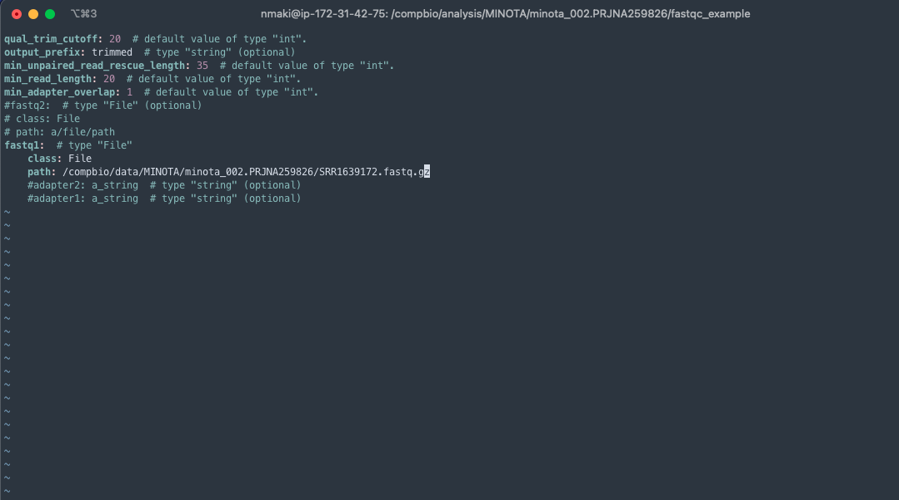
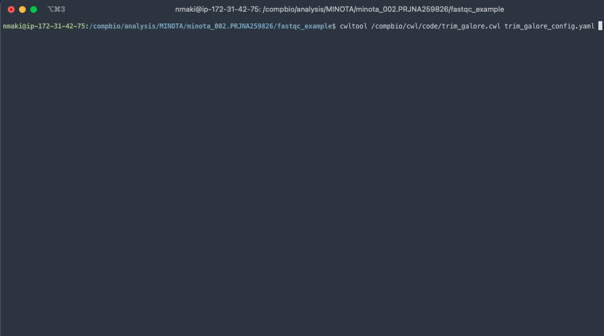

# Introduction to Quality Control
(Slide 1 + 2)

**do we encourage people to cat their reads together?**

Welcome to Detail 0 of the MINOTA Workshop. In this portion of the course, we'll be covering Quality Control (an incredibly important initial step).
First, a review of some exploratory tools for both pre and post transcriptome analysis, and how they can provide you with an overview of your input data and output results, without having to sift through pages of text log files (as fun as that sounds).

Next, we're taking a look at a couple of software packages that do the heavy lifting, and are chiefly responsible for the, er, Quality Control aspects of Quality Control. Specifically Trimmomatic, in an integrated context within Trinity, and Trim Galore!; a wonderful piece of software built by the developers of FastQC (which is, coincidentally, half of it!).

Then we'll jump into a quick tutorial on how to use the tools described above to prepare your raw sequence data for assembly.

We're also going to cover methods for transcriptome quality control, and how to critically examine your assembled output.

Lastly, we'll touch on the concept of QC'ing your read files before building an assembly, as there has been some literature that suggests QC may be detrimental, and should either be toned down or forgone entirely.

## Pre and Post Quality Control Assessment

### FastQC
(Slide 3)

Before you start sending your raw files to the chopping block, it's probably a good idea to see what's actually in them! To that end, enter FastQC.
Developed by Babraham Bioinformatics, FastQC generates a quality report of whatever you throw at it (mostly) (SAM, BAM, FastQ). It's executable both on the command line, and through a GUI (graphical user interface) application, for those of you who'd rather not channel your inner Neo (or maybe just haven't found him yet). 

The report itself is interactive, opened as an HTML webpage, and comes bundled with supplementary graphs and tables (we'll cover these in some detail). It's especially useful to run *before* you conduct QC, as it'll give you a good baseline to compare your reads to after trimming, by highlighting contaminants lurking about. If you're using a trimming tool that requires you to specify the sequence beforehand, this can be a good way to find them and plug them in accordingly.

### MultiQC
(Slide 4)

If FastQC is the one thing you want to run before you begin an analysis, then MultiQc is the last. Super simple to use, it pieces together a report composed of the aggregate results of all analyses in a given directory. This includes results from FastQC, STAR, Trim Galore!, featurecounts, etc. It's also smart enough to descend into multiple sub-directories, so once you navigate to your root project dir, simply type `multiqc .` and you're golden.

## Trimming
(Slide 5)

Trimming, in a nutshell, is spring cleaning for your input. It removes unwanted adapters, excises pesky primers and poly-A tails, and scrubs poor quality bases from your sequence file(s). This is especially important because if you allow those components to remain, it may compromise the accuracy of your results downstream. Error-ridden input can lead to unaligned reads, low mapping efficiency, and mismatches between your reads and a transcriptome/reference genome. There are a fair number of tools available, but we're going to focus on Trimmomatic, both in its standalone and Trinity-integrated form, and Trim Galore!.

### Trimmomatic
(Slide 6 + 7)

Trimmomatic is an Illumina-specific read trimming + adapter clipping tool, and functions the same in both its setups (either by itself or bundled with Trinity).
To briefly touch on Trinity and tool integration; Outside programs aside, Trinity comes bundled with a host of useful packages, allowing for (what appears to be a full pipeline run). This includes downstream processes such as transcript abundance estimation, building transcript + gene expression matrices, and transcript + gene counts.

Trimmomatic's default standalone settings are:

`java -jar trimmomatic-0.39 SE -phred33 input.fq.gz output.fq.gz ILLUMINACLIP:TruSeq3-SE:2:30:10 LEADING:3 TRAILING: 3 SLIDINGWINDOW:4:15 MINLEN:36`

* `trimmomatic-0.39` is the version of Trimmomatic being used
* `SE` is the single-end argument (`PE` for paired end)
* `-phred33` is the quality scoring used
* `input.fq.gz` and `output.fq.gz` are your input read file and the name of your trimmed output (for `PE` option, you'd have `input_1.fq.gz`, etc)
* `ILLUMINACLIP:TruSeq3-SE:2:30:10` removes single-end adapters and illumina specific sequences
* `LEADING:3` cuts leading low quality bases, with 3 as the threshold
* `TRAILING:3` does the same(though with trailing)
* `SLIDINGWINDOW:4:15` scans the read with a window 4 bases wide, excises when quality per base dips below 15
* `MINLEN:36` drops reads that are below 36 bases in length

Now in comparison (don't worry, I'm now going to write out the entire command again):

* `LEADING:5` (as opposed to 3)
* `TRAILING:5` (as opposed to 3)
* `SLIDINGWINDOW:4:5` (as opposed to 4:15)
* `MINLEN:25` (as opposed to 36)

As you can see, the Trinity-integrated version of Trimmomatic has "softer" defaults. This is explained in detail in the following [paper](https://www.frontiersin.org/articles/10.3389/fgene.2014.00013/full)

**(Summarize + Explain, or perhaps Joel has a quick+dirty summary)**

### Trim Galore!
(Slide 8)

Remember how I mentioned that you'll want a point of comparison for your untrimmed reads? Well, Trim Galore! challenges the "age-old" question of "Should I trim my reads or run FastQC?" with an answer of "why not both?!". Unmatched in executing a trimming tool (Cutadapt) and following it up with a report on the output, Trim Galore! only asks that you have both installed prior (oof). 

First, Cutadapt trims your read files, in much the same way as Trimmomatic, removing adapter sequences primers, unwanted poly-A tails, and low quality transcripts.
Then, FastQC is executed on the trimmed reads, building a report for your output. Trim Galore! also comes bundled with a standard 13bp Illumina adapter, working for PE libraries as well as SE.

### Which Should You Choose?
(Slide 9)

If you plan on using Trinity as your transcriptome assembler, it's easiest to simply enable the Trimmomatic option `--trimmomatic` (and it's been optimized for that specific use case). You can always run MultiQC on your output down the line to get your trimmed QC report. Additionally, you can modify the Trinity Trimmomatic defaults to you hearts content by using the `--quality_trimming_params` flag and setting them accordingly.

If you're using another assembler such as RNASpades, or SOAPdenovo-Trans, Trim Galore! may be the more convenient option. Though, there's nothing stopping you from replicating Trinity's Trimmomatic settings on the standalone version, and running MultiQC at the end. I would argue that at that point it's up to personal preference. 

## Preparing Sequence Data for Assembly
(Slide 10+ / Live?)

Since this workshop is being ran using the CWL language as a basis for tools and workflow analysis, we're going to use it together to produce a pre-QC FastQC report, followed by Trim Galore! to create a trimmed fastq file and accompanying report. These steps are built into our Assembly pipeline, so this will be the time to get a feel for how CWL works, and what you can expect from these tools!

First, you're going to want to fire up your favorite terminal, and ssh into your MDIBL Computational Core-provisioned machine.

It'll look something like this:

#### FastQC Guided Run

We'll be working with the FastQC tool first, so once you're in, navigate to `/compbio/cwl/config` and use the `cp` command to copy the `fastqc_config.yaml` file to `/compbio/analysis/MINOTA/minota_002.PRJNA259826`. 

Here, you will be editing the file using either `nano` or `vim`, with `nano` being the slightly more user-friendly option. 

**(I may make a doc on editing files using remote vscode editing)**

Before we edit, we want to get the path of a read file for our input!

Use the `ls` command to query all files in the `/compbio/data/MINOTA/minota_002.PRJNA259826/` directory (and you'll probably want to copy that path to a clipboard somewhere). 

Choose a file, i.e, `SRR1639172.fastq.gz` (you may want to clipboard this as well, though you can see your past queries by scrolling through the terminal).

Now, open the `fastqc_config.yaml` file with your editor of choice. You should now see a block of formatted text code.

The only portion you want to look at is the `seqfile` entry. Use the arrow keys on your keyboard to move down to `path:`, where is says `a/file/path`.

If you opened the file with `nano`, you can immediately begin deleting the text after `path:` under `seqfile:`. 

If you are using `vim`, you must first type `i` on the keyboard to enter insert mode.

Fill the empty `path:` with the file path we `ls`'d earlier: 

**If you botch or delete something, and you don't remember what it was: in `vim`, first hit the `esc` key, then type `:q!` and `enter`; in `nano`, `control + x` on macOS / `ctrl + x` on Windows, followed by `n` and `enter`.**

Those commands exit the file without saving.

To save your changes, on `vim`, `esc`, then `wq`, and `enter`; on `nano`, `control + o` and `enter`.

Great, the hard part is over! To run the FastQC tool in CWL, simply type the following on the command line:

This should process quickly, and deposit two new named files in your directory: an html file, and a zipped folder containing the raw contents of the report.

If you'd like to view the FastQC reports on your local machine, you can `rsync` them down (along with the any contents of this workshop if you so choose).

#### Trim Galore! Guided Run

For Trim Galore!, you'll want to replicate the process you did for FastQC, copying the config file from `/compbio/cwl/config/` and placing it in the same directory you did the FastQC configuration file. 

The only change is that you'll want to edit the path under `fastq1`

Then run:

This should also process relatively quickly, dropping some new files into your directory, with the `trimmed` suffix, as well as a trimmed fastq.gz file.

As like before, if you'd like to check out your trimmed FastQC report, just use `rsync` to download.

**Rsync data down and add to slides, or present live**

## Assessing Transcriptome Assembly Quality

There are a few keys ways to determine the quality of your assembled transcript (basically, how seamless did you build the assembly)?
**referencing trinity's documentation**

* Looking at the RNA-seq read representation of the assembly, with the goal being to have ~80% of input reads being present in your assembly. The reads that are left unassembled potentially point to transcripts that are lowly expressed, and without enough coverage to assemble. They may also be of lower-quality, and had slipped through the nimble fingers of trimmomatic
* Comparing the assembly against a database of known protein sequences (swissprot, etc), looking for representation of protein-coding genes
* Examine completeness based on conserved ortholog content through BUSCO
* Use TransRate to statistically analyze your transcriptome assembly