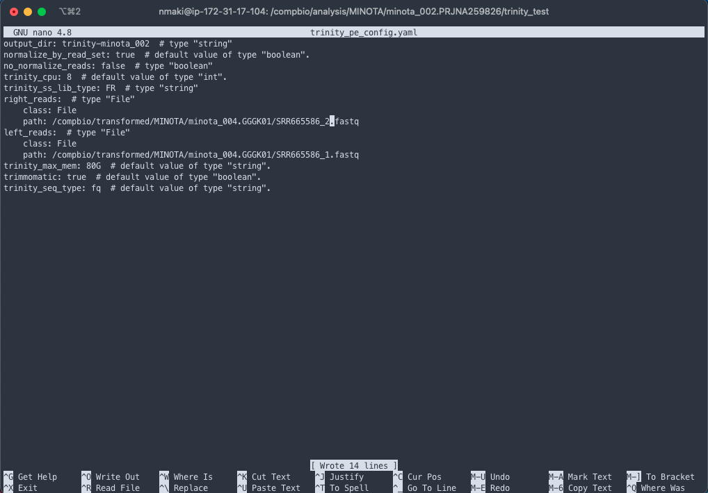
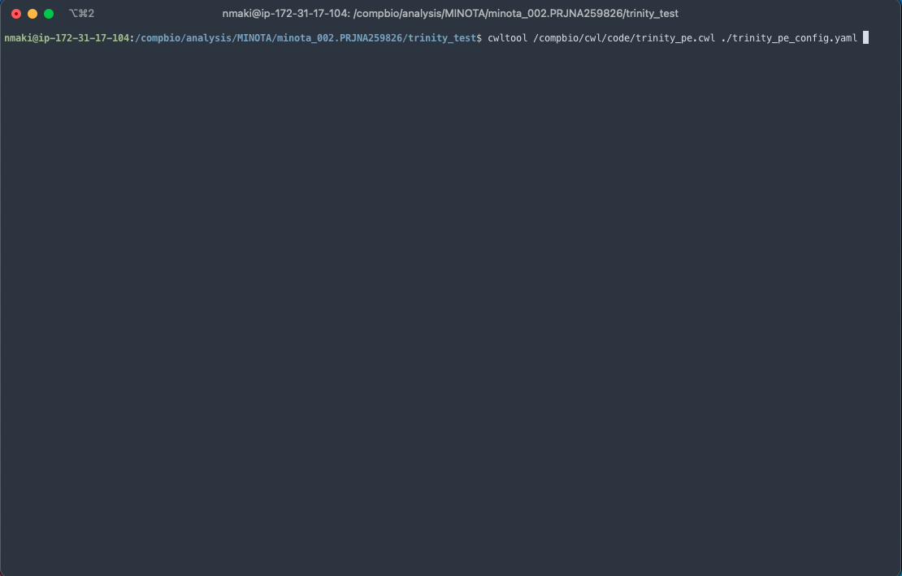

# MINOTA Workshop: Assembly with Trinity and CWL

Welcome to the MDIBL MINOTA Workshop. In this tutorial, we'll be walking through how to execute a small Trinity run using CWL. If you've worked through the Quality Control tutorial, the process to editing and launching the Trinity script will be very familiar.

First, log into your AWS provisioned machine:


Once logged in, navigate to the `/compbio/cwl/config/` directory and use the `cp` command to copy the `trinity_pe_config.yaml` configuration file to `/compbio/analysis/MINOTA/`

Depending on what dataset you want to work with for testing, create a new directory under `/minota_00*` (you can call it whatever you'd like, Trinity-test-minota_002, etc).


Then use `nano` to open the file to begin editing the configuration options:

* `output_dir` is just the name of the output files(s). Trinity can be a bit finicky, and may yell at you if the name does not contain "trinity" in some capacity
* `normalize_by_read_set` runs normalization separately for each pair of fastq files. Leave this set to `true` when working with multiple read sets, change to `false` if using only a single read pait
* `no_normalize_reads` does *not* run normalization of reads. Leave this set to `false` if working with multiple read sets
* `trinity_cpu` number of cores used in execution
* `trinity_ss_lib_type` strand-specific RNA-Seq read orientation if paired, FR or RF, if single F or R
* `right_reads` right read set
* `left reads` left read set
* `trinity_max_mem` memory set aside for this run. The default of 80GB should suffice for most Trinity executions, though you can up it if you start to run into bottlenecks
* `trimmomatic` runs trimmomatic on input read files, leave on `true` if using untrimmed reads, set to `false` if you've already conducted trimming (i.e using Trim Galore!)
* `trinity_seq_type` sequence type for input files


Fill in the `output_dir`, `trinity_ss_lib_type` (`FR` should be fine, if it yells at you change to `RF`), `left` and `right` reads respectively



Then launch like so:



I suggest that you first drop into a `tmux` session, as it may take a while, depending on your input read file size.
* To do so, enter `tmux` on the command line
* Then trigger the run with the command above
* Once it launches, you can exit the session by typing first `control + b` followed by `d` on macOS and `ctrl + b` followed by `d` on Windows


## Contact
If you have questions about the information in this workshop document, please contact:

```
Nathaniel Maki
Bioinformatics Training Specialist
MDI Biological Laboratory
nmaki[at]mdibl.org
```